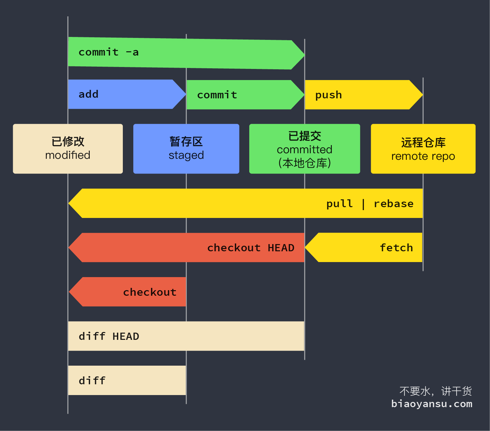

# 视频讲解

[Git教程](https://open.163.com/newview/movie/free?pid=PEV4G5DUF&mid=NEV4G5E4C)

# 安装

> 以管理员的身份在`powershell`中运行

```powershell
winget install git.git
```

# 配置全局

```shell
# 配置用户名
git config --global user.name "chen"
# 配置邮箱
git config --global user.email "3569597061@qq.com"
# 列出所有配置
git config --list
git config -l
```

# 创建仓库

```shell
# 初始化
git init
# 新建一个项目
git init <文件夹名称>
# 拷贝
git clone <url>
```

# 基本使用

```shell
# 查看本仓库的状态
git status
# 将当前目录所有文件添加到暂存区
git add .
# 只添加一个文件
git add <文件名称>
# 添加节点描述
git commit -m "描述"
# 切换版本
git reset --hard <log ID>
# 查看日志
git log
# 查看所有历史记录
git reflog
# 查看具体修改
git log -p
# 将日志一行显示
git log --oneline
git log --oneline --all
# 将日志图形化显示
git log --all --graph
# 回到节点
git checkout <log ID>
# 删除文件add不了
git config --global --add safe.directory <目录>
```

# 三种状态

|  Git描述  |  含义  |
| :-------: | :----: |
| modified  | 已修改 |
|  staged   | 已暂存 |
| committed | 已提交 |

# 标签

```shell
# 在最近一版添加标签
git tag -a <标签名> -m "备注" # annotated
# 在指定一版添加标签
git tag -a <标签名> -m "备注" <log ID>
# 查看标签详细信息
git show <tag name>
```

# 分支

```shell
# 新建分支
git branch <分支名称>
# 重命名分支
git branch -M <分支名称>
# 跳转分支
git checkout <分支名称>
# 创建分支并切换到改分支
git checkout -b <分支名称>
# 合并分支
git merge <分支名称>
```

# 远程仓库

```shell
# 添加远程仓库
git remote add <远程仓库名称> <远程仓库地址:url>
# 打印所连接的本地仓库信息
git remote
git remote -v
# 将代码提交到远程仓库
git push -u <远程仓库名称> <分支名称>
# 克隆
git clone <url>
git clone <url> <目录名称>
# 设置密码
ssh_keygen -t rsa -C <e-mail>
```

# 多人在远程仓库协同

```shell
# 获取远程更新
git pull
# 只进行下载数据
git fetch
```

> 如果远程仓库有其他人员开发的内容，要先`pull`更新本地版本，解决完不同开发者冲突的代码之后，再`push`到远程仓库

# 速查表



## 配置

* **`git config --global user.name "<姓名>"`** 设置提交者姓名。
* **`git config --global user.email "<邮箱>"`** 设置提交者邮箱。

## 基础操作

* **`git init [目录名]`** 在指定目录创建仓库，如果没有指定`目录名`将在当前目录创建仓库。
* **`git clone <远程仓库地址> [目录名]`** 从指定地址克隆仓库，若不指定`目录名`将默认创建与远程同名目录。
* **`git add <目录名|文件名>`** 将文件或目录中已修改的代码添加追暂存区。
* **`git commit -m "<注释>"`** 提交暂存区内容。
* **`git status`** 查看仓库状态

## 比对 `diff`

* **`git diff`** 比对当前内容和暂存区内容。
* **`git diff HEAD`** 比对当前内容和最近一次提交。
* **`git diff HEAD^`** 比对当前内容和倒数第二次提交。
* **`git diff HEAD^ HEAD`** 比对最近两次提交。

## 历史 `log`

* **`git log [--oneline] [--all]`** 查看提交历史。
* **`git log --oneline`** 打印为单行log。
* **`git log --all`** 打印所有记录（忽略HEAD的位置）。
* **`git log --graph`** 打印示意图（忽略HEAD的位置）。

## 分支 `branch`

* **`git branch [分支]`** 有`分支`：创建分支，无`分支`：列出所有分支。
* **`git checkout <分支>`** 切换至`分支`。
* **`git checkout -b <分支>`** 创建并切换至分支`分支`。
* **`git merge <分支>`** 将`分支`与当前分支合并。

## 远程

* `git pull` 拉取远程仓库。
* `git push <远程仓库> <分支>` 推送至远程仓库。
* `git remote add origin https://xxx.git` 新增远程仓库`origin`
* `git remote set-url origin https://xxx.git` 修改远程仓库`origin`
