# 简介

> Matplotlib是一个Python 2D绘图库，它可以在各种平台上以各种硬拷贝格式和交互式环境生成出具有出版品质的图形。Matplotlib可用于Python脚本，Python和IPython shell，Jupyter笔记本，Web应用程序服务器和四个图形用户界面工具包。
>
> Matplotlib试图让简单的事情变得更简单，让无法实现的事情变得可能实现。只需几行代码即可生成绘图，直方图，功率图，条形图，错误图，散点图等。
>
> 为了简单绘图，pyplot模块提供了类似于MATLAB的界面，特别是与IPython结合使用时。对于高级用户，可以通过面向对象的界面或MATLAB用户熟悉的一组函数完全控制线条样式，字体属性，轴属性等。
>
> * `cmap`:
>
>   `cmap`参数是色彩映射表实例或已注册色彩映射表的名称。
>
>   > `plt.cm.<TAB>`：补全
>
>   顺序色彩映射表
>
>   `cmaps["Perceptually Uniform Sequential"] = ["viridis", "plasma", "inferno", "magma", "cividis"]`
>
>   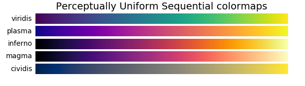
>
>   `cmaps["Sequential"] = ["Greys", "Purples", "Blues", "Greens", "Oranges", "Reds", "YlOrBr", "YlOrRd", "OrRd", "PuRd", "RdPu", "BuPu", "GnBu", "PuBu"]`
>
>   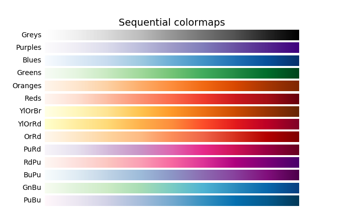
>
> * `style`
>
>   查看绘图风格：`plt.style.available`
>
>   `Solarize_Light2, _classic_test_patch, _mpl-gallery, _mpl-gallery-nogrid, bmh, classic, dark_background, fast, fivethirtyeight, ggplot, grayscale, seaborn, seaborn-bright, seaborn-colorblind, seaborn-dark, seaborn-dark-palette, seaborn-darkgrid, seaborn-deep, seaborn-muted, seaborn-notebook, seaborn-paper, seaborn-pastel, seaborn-poster, seaborn-talk, seaborn-ticks, seaborn-white, seaborn-whitegrid, tableau-colorblind10`
>
1. 图像初始化

  |               函数                |     含义     |
  | :-------------------------------: | :----------: |
  |          plt.style.use()          |   绘图风格   |
  | plt.rc("font", family = "SimHei") | 显示中文标签 |
  |   plt.rc("axes.unicode_minus")    |  显示正负号  |

2. 二维折线图

   `matplotlib.pyplot.plot(x, y, linestyle, lindwidth, color, marker, markersize, markedgecolor, markerfacecolor, markeredgewidth, label, alpha)`

  `linestyle`：指定折线的类型，可以是实线、虚线和点画线等，默认为实线。

  `linewidth`：指定折线的宽度。

  `marker`：可以为折线图添加点，该参数设置点的形状。

  `markersize`：设置点的大小。

  `markeredgecolor`:设置点的边框色。

  `markerfacecolor`:设置点的填充色。

  `markeredgewidth`：设置点的边框宽度。

  `label`：添加折线图的标签，类似于图例的作用。

  `alpha`：设置图形的透明度。


<table class=10 border=1 cellspacing=0 cellpadding=0 style='margin-left:21.0pt;
 border-collapse:collapse;border:none;mso-border-alt:solid windowtext .5pt;
 mso-yfti-tbllook:1184;mso-padding-alt:0cm 5.4pt 0cm 5.4pt'>
 <tr style='mso-yfti-irow:0;mso-yfti-firstrow:yes'>
  <td width=223 valign=top style='width:167.25pt;border:solid windowtext 1.0pt;
  mso-border-alt:solid windowtext .5pt;padding:0cm 5.4pt 0cm 5.4pt'>
  <p class=MsoNormal align=center style='text-align:center'>类型</p>
  </td>
  <td width=223 valign=top style='width:167.25pt;border:solid windowtext 1.0pt;
  border-left:none;mso-border-left-alt:solid windowtext .5pt;mso-border-alt:
  solid windowtext .5pt;padding:0cm 5.4pt 0cm 5.4pt'>
  <p class=MsoNormal align=center style='text-align:center'>符号</p>
  </td>
  <td width=223 valign=top style='width:167.3pt;border:solid windowtext 1.0pt;
  border-left:none;mso-border-left-alt:solid windowtext .5pt;mso-border-alt:
  solid windowtext .5pt;padding:0cm 5.4pt 0cm 5.4pt'>
  <p class=MsoNormal align=center style='text-align:center'>含义</p>
  </td>
 </tr>
 <tr style='mso-yfti-irow:1'>
  <td width=223 rowspan=8 style='width:167.25pt;border:solid windowtext 1.0pt;
  border-top:none;mso-border-top-alt:solid windowtext .5pt;mso-border-alt:solid windowtext .5pt;
  padding:0cm 5.4pt 0cm 5.4pt'>
  <p class=MsoNormal align=center style='text-align:center'>颜色</p>
  </td>
  <td width=223 valign=top style='width:167.25pt;border-top:none;border-left:
  none;border-bottom:solid windowtext 1.0pt;border-right:solid windowtext 1.0pt;
  mso-border-top-alt:solid windowtext .5pt;mso-border-left-alt:solid windowtext .5pt;
  mso-border-alt:solid windowtext .5pt;padding:0cm 5.4pt 0cm 5.4pt'>
  <p class=MsoNormal><span lang=EN-US>b</span></p>
  </td>
  <td width=223 valign=top style='width:167.3pt;border-top:none;border-left:
  none;border-bottom:solid windowtext 1.0pt;border-right:solid windowtext 1.0pt;
  mso-border-top-alt:solid windowtext .5pt;mso-border-left-alt:solid windowtext .5pt;
  mso-border-alt:solid windowtext .5pt;padding:0cm 5.4pt 0cm 5.4pt'>
  <p class=MsoNormal><span lang=EN-US>Blue</span></p>
  </td>
 </tr>
 <tr style='mso-yfti-irow:2'>
  <td width=223 valign=top style='width:167.25pt;border-top:none;border-left:
  none;border-bottom:solid windowtext 1.0pt;border-right:solid windowtext 1.0pt;
  mso-border-top-alt:solid windowtext .5pt;mso-border-left-alt:solid windowtext .5pt;
  mso-border-alt:solid windowtext .5pt;padding:0cm 5.4pt 0cm 5.4pt'>
  <p class=MsoNormal><span lang=EN-US>c</span></p>
  </td>
  <td width=223 valign=top style='width:167.3pt;border-top:none;border-left:
  none;border-bottom:solid windowtext 1.0pt;border-right:solid windowtext 1.0pt;
  mso-border-top-alt:solid windowtext .5pt;mso-border-left-alt:solid windowtext .5pt;
  mso-border-alt:solid windowtext .5pt;padding:0cm 5.4pt 0cm 5.4pt'>
  <p class=MsoNormal><span lang=EN-US>Cyan</span></p>
  </td>
 </tr>
 <tr style='mso-yfti-irow:3'>
  <td width=223 valign=top style='width:167.25pt;border-top:none;border-left:
  none;border-bottom:solid windowtext 1.0pt;border-right:solid windowtext 1.0pt;
  mso-border-top-alt:solid windowtext .5pt;mso-border-left-alt:solid windowtext .5pt;
  mso-border-alt:solid windowtext .5pt;padding:0cm 5.4pt 0cm 5.4pt'>
  <p class=MsoNormal><span lang=EN-US>g</span></p>
  </td>
  <td width=223 valign=top style='width:167.3pt;border-top:none;border-left:
  none;border-bottom:solid windowtext 1.0pt;border-right:solid windowtext 1.0pt;
  mso-border-top-alt:solid windowtext .5pt;mso-border-left-alt:solid windowtext .5pt;
  mso-border-alt:solid windowtext .5pt;padding:0cm 5.4pt 0cm 5.4pt'>
  <p class=MsoNormal><span lang=EN-US>Green</span></p>
  </td>
 </tr>
 <tr style='mso-yfti-irow:4'>
  <td width=223 valign=top style='width:167.25pt;border-top:none;border-left:
  none;border-bottom:solid windowtext 1.0pt;border-right:solid windowtext 1.0pt;
  mso-border-top-alt:solid windowtext .5pt;mso-border-left-alt:solid windowtext .5pt;
  mso-border-alt:solid windowtext .5pt;padding:0cm 5.4pt 0cm 5.4pt'>
  <p class=MsoNormal><span lang=EN-US>k</span></p>
  </td>
  <td width=223 valign=top style='width:167.3pt;border-top:none;border-left:
  none;border-bottom:solid windowtext 1.0pt;border-right:solid windowtext 1.0pt;
  mso-border-top-alt:solid windowtext .5pt;mso-border-left-alt:solid windowtext .5pt;
  mso-border-alt:solid windowtext .5pt;padding:0cm 5.4pt 0cm 5.4pt'>
  <p class=MsoNormal><span lang=EN-US>Black</span></p>
  </td>
 </tr>
 <tr style='mso-yfti-irow:5'>
  <td width=223 valign=top style='width:167.25pt;border-top:none;border-left:
  none;border-bottom:solid windowtext 1.0pt;border-right:solid windowtext 1.0pt;
  mso-border-top-alt:solid windowtext .5pt;mso-border-left-alt:solid windowtext .5pt;
  mso-border-alt:solid windowtext .5pt;padding:0cm 5.4pt 0cm 5.4pt'>
  <p class=MsoNormal><span lang=EN-US>m</span></p>
  </td>
  <td width=223 valign=top style='width:167.3pt;border-top:none;border-left:
  none;border-bottom:solid windowtext 1.0pt;border-right:solid windowtext 1.0pt;
  mso-border-top-alt:solid windowtext .5pt;mso-border-left-alt:solid windowtext .5pt;
  mso-border-alt:solid windowtext .5pt;padding:0cm 5.4pt 0cm 5.4pt'>
  <p class=MsoNormal><span lang=EN-US>Magenta</span></p>
  </td>
 </tr>
 <tr style='mso-yfti-irow:6'>
  <td width=223 valign=top style='width:167.25pt;border-top:none;border-left:
  none;border-bottom:solid windowtext 1.0pt;border-right:solid windowtext 1.0pt;
  mso-border-top-alt:solid windowtext .5pt;mso-border-left-alt:solid windowtext .5pt;
  mso-border-alt:solid windowtext .5pt;padding:0cm 5.4pt 0cm 5.4pt'>
  <p class=MsoNormal><span lang=EN-US>r</span></p>
  </td>
  <td width=223 valign=top style='width:167.3pt;border-top:none;border-left:
  none;border-bottom:solid windowtext 1.0pt;border-right:solid windowtext 1.0pt;
  mso-border-top-alt:solid windowtext .5pt;mso-border-left-alt:solid windowtext .5pt;
  mso-border-alt:solid windowtext .5pt;padding:0cm 5.4pt 0cm 5.4pt'>
  <p class=MsoNormal><span lang=EN-US>Red</span></p>
  </td>
 </tr>
 <tr style='mso-yfti-irow:7'>
  <td width=223 valign=top style='width:167.25pt;border-top:none;border-left:
  none;border-bottom:solid windowtext 1.0pt;border-right:solid windowtext 1.0pt;
  mso-border-top-alt:solid windowtext .5pt;mso-border-left-alt:solid windowtext .5pt;
  mso-border-alt:solid windowtext .5pt;padding:0cm 5.4pt 0cm 5.4pt'>
  <p class=MsoNormal><span lang=EN-US>w</span></p>
  </td>
  <td width=223 valign=top style='width:167.3pt;border-top:none;border-left:
  none;border-bottom:solid windowtext 1.0pt;border-right:solid windowtext 1.0pt;
  mso-border-top-alt:solid windowtext .5pt;mso-border-left-alt:solid windowtext .5pt;
  mso-border-alt:solid windowtext .5pt;padding:0cm 5.4pt 0cm 5.4pt'>
  <p class=MsoNormal><span lang=EN-US>White</span></p>
  </td>
 </tr>
 <tr style='mso-yfti-irow:8'>
  <td width=223 valign=top style='width:167.25pt;border-top:none;border-left:
  none;border-bottom:solid windowtext 1.0pt;border-right:solid windowtext 1.0pt;
  mso-border-top-alt:solid windowtext .5pt;mso-border-left-alt:solid windowtext .5pt;
  mso-border-alt:solid windowtext .5pt;padding:0cm 5.4pt 0cm 5.4pt'>
  <p class=MsoNormal><span lang=EN-US>y</span></p>
  </td>
  <td width=223 valign=top style='width:167.3pt;border-top:none;border-left:
  none;border-bottom:solid windowtext 1.0pt;border-right:solid windowtext 1.0pt;
  mso-border-top-alt:solid windowtext .5pt;mso-border-left-alt:solid windowtext .5pt;
  mso-border-alt:solid windowtext .5pt;padding:0cm 5.4pt 0cm 5.4pt'>
  <p class=MsoNormal><span lang=EN-US>Yellow</span></p>
  </td>
 </tr>
 <tr style='mso-yfti-irow:9'>
  <td width=223 rowspan=4 style='width:167.25pt;border:solid windowtext 1.0pt;
  border-top:none;mso-border-top-alt:solid windowtext .5pt;mso-border-alt:solid windowtext .5pt;
  padding:0cm 5.4pt 0cm 5.4pt'>
  <p class=MsoNormal align=center style='text-align:center'>线条样式</p>
  </td>
  <td width=223 valign=top style='width:167.25pt;border-top:none;border-left:
  none;border-bottom:solid windowtext 1.0pt;border-right:solid windowtext 1.0pt;
  mso-border-top-alt:solid windowtext .5pt;mso-border-left-alt:solid windowtext .5pt;
  mso-border-alt:solid windowtext .5pt;padding:0cm 5.4pt 0cm 5.4pt'>
  <p class=MsoNormal><span lang=EN-US>-</span></p>
  </td>
  <td width=223 valign=top style='width:167.3pt;border-top:none;border-left:
  none;border-bottom:solid windowtext 1.0pt;border-right:solid windowtext 1.0pt;
  mso-border-top-alt:solid windowtext .5pt;mso-border-left-alt:solid windowtext .5pt;
  mso-border-alt:solid windowtext .5pt;padding:0cm 5.4pt 0cm 5.4pt'>
  <p class=MsoNormal>实线</p>
  </td>
 </tr>
 <tr style='mso-yfti-irow:10'>
  <td width=223 valign=top style='width:167.25pt;border-top:none;border-left:
  none;border-bottom:solid windowtext 1.0pt;border-right:solid windowtext 1.0pt;
  mso-border-top-alt:solid windowtext .5pt;mso-border-left-alt:solid windowtext .5pt;
  mso-border-alt:solid windowtext .5pt;padding:0cm 5.4pt 0cm 5.4pt'>
  <p class=MsoNormal><span lang=EN-US>--</span></p>
  </td>
  <td width=223 valign=top style='width:167.3pt;border-top:none;border-left:
  none;border-bottom:solid windowtext 1.0pt;border-right:solid windowtext 1.0pt;
  mso-border-top-alt:solid windowtext .5pt;mso-border-left-alt:solid windowtext .5pt;
  mso-border-alt:solid windowtext .5pt;padding:0cm 5.4pt 0cm 5.4pt'>
  <p class=MsoNormal>虚线</p>
  </td>
 </tr>
 <tr style='mso-yfti-irow:11'>
  <td width=223 valign=top style='width:167.25pt;border-top:none;border-left:
  none;border-bottom:solid windowtext 1.0pt;border-right:solid windowtext 1.0pt;
  mso-border-top-alt:solid windowtext .5pt;mso-border-left-alt:solid windowtext .5pt;
  mso-border-alt:solid windowtext .5pt;padding:0cm 5.4pt 0cm 5.4pt'>
  <p class=MsoNormal><span lang=EN-US>-.</span></p>
  </td>
  <td width=223 valign=top style='width:167.3pt;border-top:none;border-left:
  none;border-bottom:solid windowtext 1.0pt;border-right:solid windowtext 1.0pt;
  mso-border-top-alt:solid windowtext .5pt;mso-border-left-alt:solid windowtext .5pt;
  mso-border-alt:solid windowtext .5pt;padding:0cm 5.4pt 0cm 5.4pt'>
  <p class=MsoNormal>点划线</p>
  </td>
 </tr>
 <tr style='mso-yfti-irow:12'>
  <td width=223 valign=top style='width:167.25pt;border-top:none;border-left:
  none;border-bottom:solid windowtext 1.0pt;border-right:solid windowtext 1.0pt;
  mso-border-top-alt:solid windowtext .5pt;mso-border-left-alt:solid windowtext .5pt;
  mso-border-alt:solid windowtext .5pt;padding:0cm 5.4pt 0cm 5.4pt'>
  <p class=MsoNormal><span lang=EN-US>:</span></p>
  </td>
  <td width=223 valign=top style='width:167.3pt;border-top:none;border-left:
  none;border-bottom:solid windowtext 1.0pt;border-right:solid windowtext 1.0pt;
  mso-border-top-alt:solid windowtext .5pt;mso-border-left-alt:solid windowtext .5pt;
  mso-border-alt:solid windowtext .5pt;padding:0cm 5.4pt 0cm 5.4pt'>
  <p class=MsoNormal>点线</p>
  </td>
 </tr>
 <tr style='mso-yfti-irow:13'>
  <td width=223 rowspan=12 style='width:167.25pt;border:solid windowtext 1.0pt;
  border-top:none;mso-border-top-alt:solid windowtext .5pt;mso-border-alt:solid windowtext .5pt;
  padding:0cm 5.4pt 0cm 5.4pt'>
  <p class=MsoNormal align=center style='text-align:center'>数据点类型</p>
  </td>
  <td width=223 valign=top style='width:167.25pt;border-top:none;border-left:
  none;border-bottom:solid windowtext 1.0pt;border-right:solid windowtext 1.0pt;
  mso-border-top-alt:solid windowtext .5pt;mso-border-left-alt:solid windowtext .5pt;
  mso-border-alt:solid windowtext .5pt;padding:0cm 5.4pt 0cm 5.4pt'>
  <p class=MsoNormal><span lang=EN-US>.</span></p>
  </td>
  <td width=223 valign=top style='width:167.3pt;border-top:none;border-left:
  none;border-bottom:solid windowtext 1.0pt;border-right:solid windowtext 1.0pt;
  mso-border-top-alt:solid windowtext .5pt;mso-border-left-alt:solid windowtext .5pt;
  mso-border-alt:solid windowtext .5pt;padding:0cm 5.4pt 0cm 5.4pt'>
  <p class=MsoNormal><span lang=EN-US>Point</span></p>
  </td>
 </tr>
 <tr style='mso-yfti-irow:14'>
  <td width=223 valign=top style='width:167.25pt;border-top:none;border-left:
  none;border-bottom:solid windowtext 1.0pt;border-right:solid windowtext 1.0pt;
  mso-border-top-alt:solid windowtext .5pt;mso-border-left-alt:solid windowtext .5pt;
  mso-border-alt:solid windowtext .5pt;padding:0cm 5.4pt 0cm 5.4pt'>
  <p class=MsoNormal><span lang=EN-US>o</span></p>
  </td>
  <td width=223 valign=top style='width:167.3pt;border-top:none;border-left:
  none;border-bottom:solid windowtext 1.0pt;border-right:solid windowtext 1.0pt;
  mso-border-top-alt:solid windowtext .5pt;mso-border-left-alt:solid windowtext .5pt;
  mso-border-alt:solid windowtext .5pt;padding:0cm 5.4pt 0cm 5.4pt'>
  <p class=MsoNormal><span lang=EN-US>Circle</span></p>
  </td>
 </tr>
 <tr style='mso-yfti-irow:15'>
  <td width=223 valign=top style='width:167.25pt;border-top:none;border-left:
  none;border-bottom:solid windowtext 1.0pt;border-right:solid windowtext 1.0pt;
  mso-border-top-alt:solid windowtext .5pt;mso-border-left-alt:solid windowtext .5pt;
  mso-border-alt:solid windowtext .5pt;padding:0cm 5.4pt 0cm 5.4pt'>
  <p class=MsoNormal><span lang=EN-US>*</span></p>
  </td>
  <td width=223 valign=top style='width:167.3pt;border-top:none;border-left:
  none;border-bottom:solid windowtext 1.0pt;border-right:solid windowtext 1.0pt;
  mso-border-top-alt:solid windowtext .5pt;mso-border-left-alt:solid windowtext .5pt;
  mso-border-alt:solid windowtext .5pt;padding:0cm 5.4pt 0cm 5.4pt'>
  <p class=MsoNormal><span lang=EN-US>Star</span></p>
  </td>
 </tr>
 <tr style='mso-yfti-irow:16'>
  <td width=223 valign=top style='width:167.25pt;border-top:none;border-left:
  none;border-bottom:solid windowtext 1.0pt;border-right:solid windowtext 1.0pt;
  mso-border-top-alt:solid windowtext .5pt;mso-border-left-alt:solid windowtext .5pt;
  mso-border-alt:solid windowtext .5pt;padding:0cm 5.4pt 0cm 5.4pt'>
  <p class=MsoNormal><span lang=EN-US>x</span></p>
  </td>
  <td width=223 valign=top style='width:167.3pt;border-top:none;border-left:
  none;border-bottom:solid windowtext 1.0pt;border-right:solid windowtext 1.0pt;
  mso-border-top-alt:solid windowtext .5pt;mso-border-left-alt:solid windowtext .5pt;
  mso-border-alt:solid windowtext .5pt;padding:0cm 5.4pt 0cm 5.4pt'>
  <p class=MsoNormal><span lang=EN-US>Cross</span></p>
  </td>
 </tr>
 <tr style='mso-yfti-irow:17'>
  <td width=223 valign=top style='width:167.25pt;border-top:none;border-left:
  none;border-bottom:solid windowtext 1.0pt;border-right:solid windowtext 1.0pt;
  mso-border-top-alt:solid windowtext .5pt;mso-border-left-alt:solid windowtext .5pt;
  mso-border-alt:solid windowtext .5pt;padding:0cm 5.4pt 0cm 5.4pt'>
  <p class=MsoNormal><span lang=EN-US>s</span></p>
  </td>
  <td width=223 valign=top style='width:167.3pt;border-top:none;border-left:
  none;border-bottom:solid windowtext 1.0pt;border-right:solid windowtext 1.0pt;
  mso-border-top-alt:solid windowtext .5pt;mso-border-left-alt:solid windowtext .5pt;
  mso-border-alt:solid windowtext .5pt;padding:0cm 5.4pt 0cm 5.4pt'>
  <p class=MsoNormal><span lang=EN-US>Square</span></p>
  </td>
 </tr>
 <tr style='mso-yfti-irow:18'>
  <td width=223 valign=top style='width:167.25pt;border-top:none;border-left:
  none;border-bottom:solid windowtext 1.0pt;border-right:solid windowtext 1.0pt;
  mso-border-top-alt:solid windowtext .5pt;mso-border-left-alt:solid windowtext .5pt;
  mso-border-alt:solid windowtext .5pt;padding:0cm 5.4pt 0cm 5.4pt'>
  <p class=MsoNormal><span lang=EN-US>p</span></p>
  </td>
  <td width=223 valign=top style='width:167.3pt;border-top:none;border-left:
  none;border-bottom:solid windowtext 1.0pt;border-right:solid windowtext 1.0pt;
  mso-border-top-alt:solid windowtext .5pt;mso-border-left-alt:solid windowtext .5pt;
  mso-border-alt:solid windowtext .5pt;padding:0cm 5.4pt 0cm 5.4pt'>
  <p class=MsoNormal><span lang=EN-US>Pentagon</span></p>
  </td>
 </tr>
 <tr style='mso-yfti-irow:19'>
  <td width=223 valign=top style='width:167.25pt;border-top:none;border-left:
  none;border-bottom:solid windowtext 1.0pt;border-right:solid windowtext 1.0pt;
  mso-border-top-alt:solid windowtext .5pt;mso-border-left-alt:solid windowtext .5pt;
  mso-border-alt:solid windowtext .5pt;padding:0cm 5.4pt 0cm 5.4pt'>
  <p class=MsoNormal><span lang=EN-US>D/d</span></p>
  </td>
  <td width=223 valign=top style='width:167.3pt;border-top:none;border-left:
  none;border-bottom:solid windowtext 1.0pt;border-right:solid windowtext 1.0pt;
  mso-border-top-alt:solid windowtext .5pt;mso-border-left-alt:solid windowtext .5pt;
  mso-border-alt:solid windowtext .5pt;padding:0cm 5.4pt 0cm 5.4pt'>
  <p class=MsoNormal><span lang=EN-US>Diamond</span></p>
  </td>
 </tr>
 <tr style='mso-yfti-irow:20'>
  <td width=223 valign=top style='width:167.25pt;border-top:none;border-left:
  none;border-bottom:solid windowtext 1.0pt;border-right:solid windowtext 1.0pt;
  mso-border-top-alt:solid windowtext .5pt;mso-border-left-alt:solid windowtext .5pt;
  mso-border-alt:solid windowtext .5pt;padding:0cm 5.4pt 0cm 5.4pt'>
  <p class=MsoNormal><span lang=EN-US>h</span></p>
  </td>
  <td width=223 valign=top style='width:167.3pt;border-top:none;border-left:
  none;border-bottom:solid windowtext 1.0pt;border-right:solid windowtext 1.0pt;
  mso-border-top-alt:solid windowtext .5pt;mso-border-left-alt:solid windowtext .5pt;
  mso-border-alt:solid windowtext .5pt;padding:0cm 5.4pt 0cm 5.4pt'>
  <p class=MsoNormal><span lang=EN-US>Hexagon</span></p>
  </td>
 </tr>
 <tr style='mso-yfti-irow:21'>
  <td width=223 valign=top style='width:167.25pt;border-top:none;border-left:
  none;border-bottom:solid windowtext 1.0pt;border-right:solid windowtext 1.0pt;
  mso-border-top-alt:solid windowtext .5pt;mso-border-left-alt:solid windowtext .5pt;
  mso-border-alt:solid windowtext .5pt;padding:0cm 5.4pt 0cm 5.4pt'>
  <p class=MsoNormal><span lang=EN-US>+</span></p>
  </td>
  <td width=223 valign=top style='width:167.3pt;border-top:none;border-left:
  none;border-bottom:solid windowtext 1.0pt;border-right:solid windowtext 1.0pt;
  mso-border-top-alt:solid windowtext .5pt;mso-border-left-alt:solid windowtext .5pt;
  mso-border-alt:solid windowtext .5pt;padding:0cm 5.4pt 0cm 5.4pt'>
  <p class=MsoNormal>加号</p>
  </td>
 </tr>
 <tr style='mso-yfti-irow:22'>
  <td width=223 valign=top style='width:167.25pt;border-top:none;border-left:
  none;border-bottom:solid windowtext 1.0pt;border-right:solid windowtext 1.0pt;
  mso-border-top-alt:solid windowtext .5pt;mso-border-left-alt:solid windowtext .5pt;
  mso-border-alt:solid windowtext .5pt;padding:0cm 5.4pt 0cm 5.4pt'>
  <p class=MsoNormal><span lang=EN-US>|</span></p>
  </td>
  <td width=223 valign=top style='width:167.3pt;border-top:none;border-left:
  none;border-bottom:solid windowtext 1.0pt;border-right:solid windowtext 1.0pt;
  mso-border-top-alt:solid windowtext .5pt;mso-border-left-alt:solid windowtext .5pt;
  mso-border-alt:solid windowtext .5pt;padding:0cm 5.4pt 0cm 5.4pt'>
  <p class=MsoNormal>竖直线</p>
  </td>
 </tr>
 <tr style='mso-yfti-irow:23'>
  <td width=223 valign=top style='width:167.25pt;border-top:none;border-left:
  none;border-bottom:solid windowtext 1.0pt;border-right:solid windowtext 1.0pt;
  mso-border-top-alt:solid windowtext .5pt;mso-border-left-alt:solid windowtext .5pt;
  mso-border-alt:solid windowtext .5pt;padding:0cm 5.4pt 0cm 5.4pt'>
  <p class=MsoNormal><span lang=EN-US>V^&lt;&gt;</span></p>
  </td>
  <td width=223 valign=top style='width:167.3pt;border-top:none;border-left:
  none;border-bottom:solid windowtext 1.0pt;border-right:solid windowtext 1.0pt;
  mso-border-top-alt:solid windowtext .5pt;mso-border-left-alt:solid windowtext .5pt;
  mso-border-alt:solid windowtext .5pt;padding:0cm 5.4pt 0cm 5.4pt'>
  <p class=MsoNormal>下、上、左、右三角</p>
  </td>
 </tr>
 <tr style='mso-yfti-irow:24;mso-yfti-lastrow:yes'>
  <td width=223 valign=top style='width:167.25pt;border-top:none;border-left:
  none;border-bottom:solid windowtext 1.0pt;border-right:solid windowtext 1.0pt;
  mso-border-top-alt:solid windowtext .5pt;mso-border-left-alt:solid windowtext .5pt;
  mso-border-alt:solid windowtext .5pt;padding:0cm 5.4pt 0cm 5.4pt'>
  <p class=MsoNormal><span lang=EN-US>1234</span></p>
  </td>
  <td width=223 valign=top style='width:167.3pt;border-top:none;border-left:
  none;border-bottom:solid windowtext 1.0pt;border-right:solid windowtext 1.0pt;
  mso-border-top-alt:solid windowtext .5pt;mso-border-left-alt:solid windowtext .5pt;
  mso-border-alt:solid windowtext .5pt;padding:0cm 5.4pt 0cm 5.4pt'>
  <p class=MsoNormal><span lang=EN-US>Tripod</span>向下、上、左、右</p>
  </td>
 </tr>
</table>

`plt.xlabel(xlabel, fontdict, labelpad, loc)`[^1]

`plt.xlabel(xlabel, fontdict, labelpad, loc)`

`plt.xlim(left, right)`

`plt.xlim(left, right)`

`plt.xticks(ticks, labels)`

`plt.yticks(ticks, labels)`

`plt.title(label, fontdict, loc, pad)`

`plt.legend()`

`plt.grid(visible = None, which = ’major’ , axis = ’both’ , **kwargs)`

`plt.fill_between(x, y, where, interpolate, color, facecolor, alpha, label)`[^2]

`plt.show()`

[^1]: loc：‘left’ ‘center’ ‘right’
[^2]: label：where: 值域；interpolate: 计算交点

# 折线图

```python
import numpy as np
import matplotlib.pyplot as plt

plt.style.use('seaborn-whitegrid')
fig = plt.figure()
ax = plt.axes()
x = np.linspace(-5, 5, 1000)
# 限制坐标轴范围
ax.set_xlim(-6, 6)
ax.set_ylim(-1.2, 1.2)
ax.plot(x, np.sin(x))
ax.plot(x + np.pi / 4, np.sin(x))
plt.show()
```

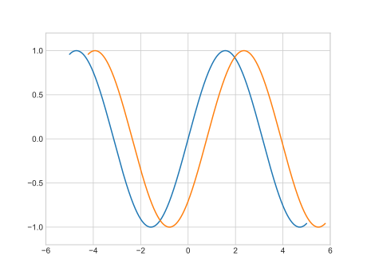

`plt.axis("tight")`：将坐标轴压缩到刚好足够绘制折线图像的大小

`plt.axis("equal")`：设置x轴与y轴刻度等长

`plt.axis("square")`：x，y轴范围相同

`plt.axis("off")`：关闭坐标轴

<table border="1" class="docutils align-default">
<colgroup>
<col width="12%" />
<col width="88%" />
</colgroup>
<thead valign="bottom">
<tr class="row-odd"><th class="head">Value</th>
<th class="head">Description</th>
</tr>
</thead>
<tbody valign="top">
<tr class="row-even"><td>'on'</td>
<td>Turn on axis lines and labels. Same as <code class="docutils literal notranslate"><span class="pre">True</span></code>.</td>
</tr>
<tr class="row-odd"><td>'off'</td>
<td>Turn off axis lines and labels. Same as <code class="docutils literal notranslate"><span class="pre">False</span></code>.</td>
</tr>
<tr class="row-even"><td>'equal'</td>
<td>Set equal scaling (i.e., make circles circular) by
changing axis limits. This is the same as
<code class="docutils literal notranslate"><span class="pre">ax.set_aspect('equal',</span> <span class="pre">adjustable='datalim')</span></code>.
Explicit data limits may not be respected in this case.</td>
</tr>
<tr class="row-odd"><td>'scaled'</td>
<td>Set equal scaling (i.e., make circles circular) by
changing dimensions of the plot box. This is the same as
<code class="docutils literal notranslate"><span class="pre">ax.set_aspect('equal',</span> <span class="pre">adjustable='box',</span> <span class="pre">anchor='C')</span></code>.
Additionally, further autoscaling will be disabled.</td>
</tr>
<tr class="row-even"><td>'tight'</td>
<td>Set limits just large enough to show all data, then
disable further autoscaling.</td>
</tr>
<tr class="row-odd"><td>'auto'</td>
<td>Automatic scaling (fill plot box with data).</td>
</tr>
<tr class="row-even"><td>'normal'</td>
<td>Same as 'auto'; deprecated.</td>
</tr>
<tr class="row-odd"><td>'image'</td>
<td>'scaled' with axis limits equal to data limits.</td>
</tr>
<tr class="row-even"><td>'square'</td>
<td>Square plot; similar to 'scaled', but initially forcing
<code class="docutils literal notranslate"><span class="pre">xmax-xmin</span> <span class="pre">==</span> <span class="pre">ymax-ymin</span></code>.</td>
</tr>
</tbody>
</table>
<table>
</dd>
<dt><strong>emit</strong><span class="classifier">bool, optional, default <em>True</em></span></dt><dd><p>Whether observers are notified of the axis limit change.
This option is passed on to <a class="reference internal" href="matplotlib.axes.Axes.set_xlim.html#matplotlib.axes.Axes.set_xlim" title="matplotlib.axes.Axes.set_xlim"><code class="xref py py-obj docutils literal notranslate"><span class="pre">set_xlim</span></code></a> and
<a class="reference internal" href="matplotlib.axes.Axes.set_ylim.html#matplotlib.axes.Axes.set_ylim" title="matplotlib.axes.Axes.set_ylim"><code class="xref py py-obj docutils literal notranslate"><span class="pre">set_ylim</span></code></a>.</p>
</dd>
</dl>
</td>
</tr>
<tr class="field-even field"><th class="field-name">Returns:</th><td class="field-body"><dl class="first last docutils">
<dt><strong>xmin, xmax, ymin, ymax</strong><span class="classifier">float</span></dt><dd><p>The axis limits.</p>
</dd>
</dl>
</td>
</tr>
</table>


|   plt    |      ax      |
| :------: | :----------: |
| xlabel() | set_xlabel() |
| ylabel() | set_ylabel() |
|  xlim()  |  set_xlim()  |
|  ylim()  |  set_ylim()  |
| title()  | set_title()  |

# 散点图

## `plt.plot`

```python
import numpy as np
import matplotlib.pyplot as plt

rng = np.random.RandomState(0)
for marker in ['o','.',',','x','+','v','w','<','>','s','d']:
    plt.plot(rng.rand(5),rng.rand(5),marker,label="marker='{0}'".format(marker))

plt.legend(numpoints=1)
plt.xlim(0,1.8)
plt.show()
```

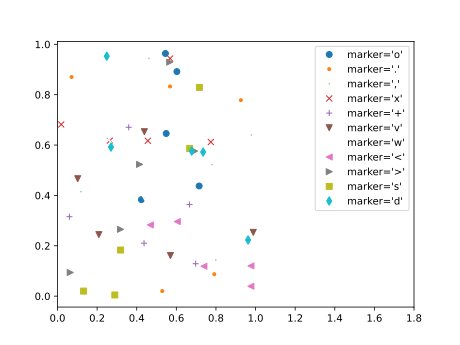

## `plt.scatter`

> `plt.scatter`和`plt.plot`的主要区别在于，`plt.scatter`可以针对每个点设置不同属性（大小、填充颜色、边缘颜色等），还可以通过数据集合对这些属性进行设置。
>
> 图表中的点大小的单位是像素。使用这种方法，散点的颜色和大小都能用来展示数据信息，在希望展示多个维度数据集合的情况下很直观。

```python
import numpy as np
import matplotlib.pyplot as plt

rng = np.random.RandomState(0)
x = rng.randn(100)
y = rng.randn(100)
colors = rng.rand(100)
sizes = 1000 * rng.rand(100)
plt.scatter(x, y, c=colors, s=sizes, alpha=0.3, cmap='viridis')
#显示颜色对比条
plt.colorbar()
plt.show()
```

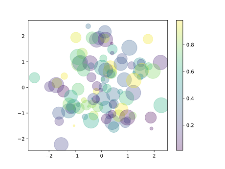

```python
from sklearn.datasets import load_iris
import matplotlib.pyplot as plt

iris = load_iris()
features = iris.data.T
plt.scatter(features[0],
            features[1],
            alpha=0.2,
            s=100 * features[3],
            c=iris.target,
            cmap='viridis')
plt.xlabel(iris.feature_names[0])
plt.ylabel(iris.feature_names[1])
plt.show()
```

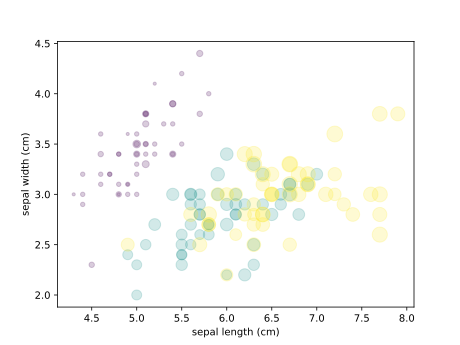

> 当我们使用`scikit-learn`中的鸢尾花数据集，里面的每个样本都是三种鸢尾花中的其中一种，并带有仔细测量的花瓣和花萼的尺寸数据：我们可以从上图中看出，可以通过散点图同时展示该数据集的四个不同维度：图中的(x, y)位置代表每个样本的花萼的长度和宽度，散点的大小代表每个样本的花瓣的宽度，而散点的颜色代表一种特定的鸢尾花类型。如上图的多种颜色和多种属性的散点图对于我们分析和展示数据集时都非常有帮助

# 误差可视化

## 误差条

```python
import matplotlib.pyplot as plt
import numpy as np

x = np.linspace(0, 10, 50)
dy = 0.8
y = np.sin(x) + dy * np.random.randn(50)
plt.style.use('seaborn-whitegrid')
plt.errorbar(x, y, yerr=dy, fmt='.k')
plt.show()
```

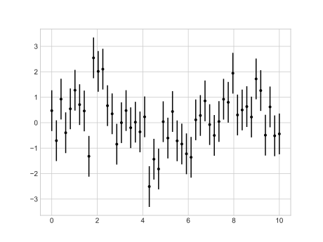

```python
import matplotlib.pyplot as plt
import numpy as np

x = np.linspace(0, 10, 50)
dy = 0.8
y = np.sin(x) + dy * np.random.randn(50)
plt.style.use('seaborn-whitegrid')
plt.errorbar(x,
             y,
             yerr=dy,
             fmt='o',
             color='black',
             ecolor='lightgray',
             elinewidth=3,
             capsize=0)
plt.show()

""" 
可选关键字参数:
xerr/ err: [scalar | N, Nx1, or 2xN array-like]
如果是标量数、len(N)类数组对象或Nx1类数组对象，则相对于数据在+/-值处绘制错误条。
如果一个形状为2xN的序列，则在相对于数据的-row1和+row2处绘制错误条。

fmt: [" | 'none' | plot format string]
情节格式符号。如果fmt为'none'(不区分大小写)，则只绘制错误栏。例如，这用于向条形图添加错误条。默认是"，一个空的绘图格式字符串;属性与plot的默认值相同。

color:[None| mpl color]
一个matplotlib颜色参数，它给出错误条线的颜色;如果为None，则使用连接标记的线的颜色。

elinewidth:scalar
错误条的线宽。如果为None，则使用线宽。

copsize:scaler
误差条的长度以点为单位;如果为None，它将接受errorbar的值。倾覆rcParam。

capthick:scaler
别名kwarg到markeredgewidth(又名- mew)。这个设置是控制错误条盖厚度的属性的一个更合理的名称。为了向后兼容，如果给定了mew或markeredgewidth，那么它们将覆盖capthick。这在以后的版本中可能会改变。

barsabove:[True|False]
如果为True，将绘制绘制符号上方的错误条。默认如下。

lolims / uplims / xlolims / xuplims: [False | True]
这些参数可用于指示一个值只给出上/下限。在这种情况下，插入符号被用来表示这一点。lim -arguments可能与xerr和yerr具有相同的类型。要使用带有倒轴的限制，必须在errorbar之前调用set_xlim或set_ylim。

errorevery:positive integer
errorbars次级样本。例如，如果errorvery =5，将绘制每5个数据点的错误条。数据图本身仍然显示所有的数据点。

所有其他关键字参数都传递给用于标记的plot命令。 
"""
```

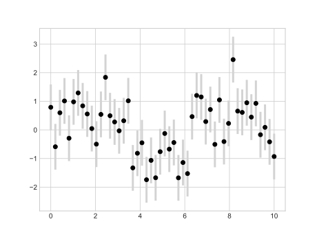

> 通常将误差线条颜色调整为浅色会更加清晰，特别是在数据点比较密集的情况下

## 连续误差

> 可以通过简单将`plt.plot`和`plt.fill_between`函数结合起来达到目标。

```python
from sklearn.gaussian_process import GaussianProcessRegressor
import numpy as np
import matplotlib.pyplot as plt

#定义模型和一些符合模型的点
model = lambda x: x * np.sin(x)
xdata = np.array([1, 3, 5, 6, 8])
ydata = model(xdata)

#计算高斯过程回归，使其符合fit数据点
gp = GaussianProcessRegressor()
gp.fit(xdata[:, np.newaxis], ydata)
xfit = np.linspace(0, 10, 1000)
yfit, std = gp.predict(xfit[:, np.newaxis], return_std=True)

#两倍sigma~95%确定区域
dyfit = 2 * std

#可视化结果
plt.plot(xdata, ydata, 'or')
plt.plot(xfit, yfit, '-', color='gray')
plt.fill_between(xfit, yfit - dyfit, yfit + dyfit, color='gray', alpha=0.2)
plt.xlim(0, 10)
plt.show()
```

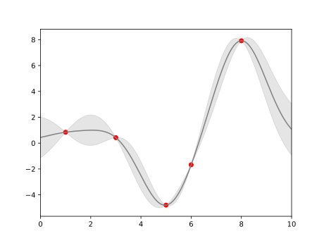

# 密度和轮廓图


>`plt.contour`：绘制轮廓图
>
>`contour(X, Y, Z, levels, colors, linewidths)`
>
> > Optional keyword arguments:
> >
> > * *corner_mask*: [ *True* | *False* | 'legacy' ]
> >
> >   Enable/disable corner masking, which only has an effect if *Z* is a masked array. If *False*, any quad touching a masked point is masked out. If *True*, only the triangular corners of quads nearest those points are always masked out, other triangular corners comprising three unmasked points are contoured as usual. If 'legacy', the old contouring algorithm is used, which is equivalent to *False* and is deprecated, only remaining whilst the new algorithm is tested fully.If not specified, the default is taken from rcParams['contour.corner_mask'], which is True unless it has been modified.
> >
> > * *colors*: [ *None* | string | (mpl_colors) ]
> >
> >   If *None*, the colormap specified by cmap will be used.If a string, like 'r' or 'red', all levels will be plotted in this color.If a tuple of matplotlib color args (string, float, rgb, etc), different levels will be plotted in different colors in the order specified.
> >
> > * *alpha*: float
> >
> >   The alpha blending value
> >
> > * *cmap*: [ *None* | Colormap ]
> >
> >   A cm [Colormap]() instance or *None*. If *cmap*is *None* and *colors* is *None*, a default Colormap is used.
> >
> > * *norm*: [ *None* | Normalize ]
> >
> >   A [Normalize]() instance for scaling data values to colors. If *norm* is *None* and*colors* is *None*, the default linear scaling is used.
> >
> > * *vmin*, *vmax*: [ *None* | scalar ]
> >
> >   If not *None*, either or both of these values will be supplied to the [Normalize]() instance, overriding the default color scaling based on *levels*.
> >
> > * *levels*: [level0, level1, ..., leveln]
> >
> >   A list of floating point numbers indicating the level curves to draw, in increasing order; e.g., to draw just the zero contour pass `levels=[0]`
> >
> > * *origin*: [ *None* | 'upper' | 'lower' | 'image' ]
> >
> >   If *None*, the first value of *Z* will correspond to the lower left corner, location (0,0). If 'image', the rc value for `image.origin`will be used.This keyword is not active if *X* and *Y* are specified in the call to contour.
> >
> > *extent*: [ *None* | (x0,x1,y0,y1) ]
> >
> > If *origin* is not *None*, then *extent* is interpreted as in [imshow](): it gives the outer pixel boundaries. In this case, the position of Z[0,0] is the center of the pixel, not a corner. If *origin* is *None*, then (*x0*, *y0*) is the position of Z[0,0], and (*x1*, *y1*) is the position of Z[-1,-1].
> >
> > This keyword is not active if *X* and *Y* are specified in the call to contour.
> >
> > * *locator*: [ *None* | ticker.Locator subclass ]
> >
> >   If *locator* is *None*, the default[MaxNLocator]() is used. The locator is used to determine the contour levels if they are not given explicitly via the *V* argument.
> >
> > * *extend*: [ 'neither' | 'both' | 'min' | 'max' ]
> >
> >   Unless this is 'neither', contour levels are automatically added to one or both ends of the range so that all data are included. These added ranges are then mapped to the special colormap values which default to the ends of the colormap range, but can be set via [set_under]() and [set_over]()methods.
> >
> > * *xunits*, *yunits*: [ *None* | registered units ]
> >
> >   Override axis units by specifying an instance of a [ConversionInterface]().
> >
> > * *antialiased*: [ *True* | *False* ]
> >
> >   enable antialiasing, overriding the defaults. For filled contours, the default is *True*. For line contours, it is taken from rcParams['lines.antialiased'].
> >
> > * *nchunk*: [ 0 | integer ]
> >
> >   If 0, no subdivision of the domain. Specify a positive integer to divide the domain into subdomains of *nchunk* by *nchunk*quads. Chunking reduces the maximum length of polygons generated by the contouring algorithm which reduces the rendering workload passed on to the backend and also requires slightly less RAM. It can however introduce rendering artifacts at chunk boundaries depending on the backend, the *antialiased* flag and value of *alpha*.
> >
> > contour-only keyword arguments:
> >
> > * *linewidths*: [ *None* | number | tuple of numbers ]
> >
> >   If *linewidths* is *None*, the default width in `lines.linewidth` in `matplotlibrc` is used.If a number, all levels will be plotted with this linewidth.If a tuple, different levels will be plotted with different linewidths in the order specified.
> >
> > * *linestyles*: [ *None* | 'solid' | 'dashed' | 'dashdot' | 'dotted' ]
> >
> >   If *linestyles* is *None*, the default is 'solid' unless the lines are monochrome. In that case, negative contours will take their linestyle from the `matplotlibrc` `contour.negative_linestyle`setting.*linestyles* can also be an iterable of the above strings specifying a set of linestyles to be used. If this iterable is shorter than the number of contour levels it will be repeated as necessary.
> >
> > contourf-only keyword arguments:
> >
> > * *hatches*:
> >
> >   A list of cross hatch patterns to use on the filled areas. If None, no hatching will be added to the contour. Hatching is supported in the PostScript, PDF, SVG and Agg backends only.
>
>`plt.contourf`：绘制填充区域颜色的图表
>
> > Optional keyword arguments:
> >
> > * *corner_mask*: [ *True* | *False* | 'legacy' ]
> >
> >   Enable/disable corner masking, which only has an effect if *Z* is a masked array. If *False*, any quad touching a masked point is masked out. If *True*, only the triangular corners of quads nearest those points are always masked out, other triangular corners comprising three unmasked points are contoured as usual. If 'legacy', the old contouring algorithm is used, which is equivalent to *False* and is deprecated, only remaining whilst the new algorithm is tested fully.If not specified, the default is taken from rcParams['contour.corner_mask'], which is True unless it has been modified.
> >
> > * *colors*: [ *None* | string | (mpl_colors) ]
> >
> >   If *None*, the colormap specified by cmap will be used.If a string, like 'r' or 'red', all levels will be plotted in this color.If a tuple of matplotlib color args (string, float, rgb, etc), different levels will be plotted in different colors in the order specified.
> >
> > * *alpha*: float
> >
> >   The alpha blending value
> >
> > * *cmap*: [ *None* | Colormap ]
> >
> >   A cm [Colormap]() instance or *None*. If *cmap*is *None* and *colors* is *None*, a default Colormap is used.
> >
> > * *norm*: [ *None* | Normalize ]
> >
> >   A [Normalize]() instance for scaling data values to colors. If *norm* is *None* and*colors* is *None*, the default linear scaling is used.
> >
> > * *vmin*, *vmax*: [ *None* | scalar ]
> >
> >   If not *None*, either or both of these values will be supplied to the [Normalize]()instance, overriding the default color scaling based on *levels*.
> >
> > * *levels*: [level0, level1, ..., leveln]
> >
> >   A list of floating point numbers indicating the level curves to draw, in increasing order; e.g., to draw just the zero contour pass `levels=[0]`
> >
> > * *origin*: [ *None* | 'upper' | 'lower' | 'image' ]
> >
> >   If *None*, the first value of *Z* will correspond to the lower left corner, location (0,0). If 'image', the rc value for `image.origin` will be used.This keyword is not active if *X* and *Y* are specified in the call to contour.
> >
> > *extent*: [ *None* | (x0,x1,y0,y1) ]
> >
> > If *origin* is not *None*, then *extent* is interpreted as in [imshow](): it gives the outer pixel boundaries. In this case, the position of Z[0,0] is the center of the pixel, not a corner. If *origin* is*None*, then (*x0*, *y0*) is the position of Z[0,0], and (*x1*, *y1*) is the position of Z[-1,-1].
> >
> > This keyword is not active if *X* and *Y* are specified in the call to contour.
> >
> > * *locator*: [ *None* | ticker.Locator subclass ]
> >
> >   If *locator* is *None*, the default[MaxNLocator]() is used. The locator is used to determine the contour levels if they are not given explicitly via the *V* argument.
> >
> > * *extend*: [ 'neither' | 'both' | 'min' | 'max' ]
> >
> >   Unless this is 'neither', contour levels are automatically added to one or both ends of the range so that all data are included. These added ranges are then mapped to the special colormap values which default to the ends of the colormap range, but can be set via [set_under]() and [set_over]()methods.
> >
> > * *xunits*, *yunits*: [ *None* | registered units ]
> >
> >   Override axis units by specifying an instance of a [ConversionInterface]().
> >
> > * *antialiased*: [ *True* | *False* ]
> >
> >   enable antialiasing, overriding the defaults. For filled contours, the default is *True*. For line contours, it is taken from rcParams['lines.antialiased'].
> >
> > * *nchunk*: [ 0 | integer ]
> >
> >   If 0, no subdivision of the domain. Specify a positive integer to divide the domain into subdomains of *nchunk* by *nchunk*quads. Chunking reduces the maximum length of polygons generated by the contouring algorithm which reduces the rendering workload passed on to the backend and also requires slightly less RAM. It can however introduce rendering artifacts at chunk boundaries depending on the backend, the *antialiased* flag and value of *alpha*.
> >
> > contour-only keyword arguments:
> >
> > * *linewidths*: [ *None* | number | tuple of numbers ]
> >
> >   If *linewidths* is *None*, the default width in `lines.linewidth` in `matplotlibrc` is used.If a number, all levels will be plotted with this linewidth.If a tuple, different levels will be plotted with different linewidths in the order specified.
> >
> > * *linestyles*: [ *None* | 'solid' | 'dashed' | 'dashdot' | 'dotted' ]
> >
> >   If *linestyles* is *None*, the default is 'solid' unless the lines are monochrome. In that case, negative contours will take their linestyle from the `matplotlibrc` `contour.negative_linestyle`setting.*linestyles* can also be an iterable of the above strings specifying a set of linestyles to be used. If this iterable is shorter than the number of contour levels it will be repeated as necessary.
> >
> > contourf-only keyword arguments:
> >
> > * *hatches*:
> >
> >   A list of cross hatch patterns to use on the filled areas. If None, no hatching will be added to the contour. Hatching is supported in the PostScript, PDF, SVG and Agg backends only.
>
>`plt.clabel`：绘制等高线
>
> > Optional keyword arguments:
> >
> > * *fontsize*:
> >
> >   size in points or relative size e.g., 'smaller', 'x-large'
> >
> > * *colors*:
> >
> >   if *None*, the color of each label matches the color of the corresponding contourif one string color, e.g., *colors* = 'r' or *colors* = 'red', all labels will be plotted in this colorif a tuple of matplotlib color args (string, float, rgb, etc), different labels will be plotted in different colors in the order specified
> >
> > * *inline*:
> >
> >   controls whether the underlying contour is removed or not. Default is *True*.
> >
> > * *inline_spacing*:
> >
> >   space in pixels to leave on each side of label when placing inline. Defaults to 5. This spacing will be exact for labels at locations where the contour is straight, less so for labels on curved contours.
> >
> > * *fmt*:
> >
> >   a format string for the label. Default is '%1.3f' Alternatively, this can be a dictionary matching contour levels with arbitrary strings to use for each contour level (i.e., fmt[level]=string), or it can be any callable, such as a [Formatter]() instance, that returns a string when called with a numeric contour level.
> >
> > * *manual*:
> >
> >   if *True*, contour labels will be placed manually using mouse clicks. Click the first button near a contour to add a label, click the second button (or potentially both mouse buttons at once) to finish adding labels. The third button can be used to remove the last label added, but only if labels are not inline. Alternatively, the keyboard can be used to select label locations (enter to end label placement, delete or backspace act like the third mouse button, and any other key will select a label location).*manual* can be an iterable object of x,y tuples. Contour labels will be created as if mouse is clicked at each x,y positions.
> >
> > * *rightside_up*:
> >
> >   if *True* (default), label rotations will always be plus or minus 90 degrees from level.
> >
> > * *use_clabeltext*:
> >
> >   if *True* (default is False), ClabelText class (instead of matplotlib.Text) is used to create labels. ClabelText recalculates rotation angles of texts during the drawing time, therefore this can be used if aspect of the axes changes.
> >
> > Additional kwargs: hold = [True|False] overrides default hold state
>
>`plt.colorbar`：在图表边上创建一个颜色图例用以展示 颜色所表示的数值区域
>
>`plt.colorbar(mappable = None, cax = None, ax = None, **kw)`
>
> > arguments:
> >
> > * *mappable*
> >
> >   the [Image](), [ContourSet](), etc. to which the colorbar applies; this argument is mandatory for the [colorbar]() method but optional for the [colorbar]() function, which sets the default to the current image.
> >
> > keyword arguments:
> >
> > * *cax*
> >
> >   None | axes object into which the colorbar will be drawn
> >
> > * *ax*
> >
> >   None | parent axes object(s) from which space for a new colorbar axes will be stolen. If a list of axes is given they will all be resized to make room for the colorbar axes.
> >
> > * *use_gridspec*
> >
> >   False | If *cax* is None, a new *cax* is created as an instance of Axes. If *ax* is an instance of Subplot and *use_gridspec* is True, *cax* is created as an instance of Subplot using the grid_spec module.
> >
> > Additional keyword arguments are of two kinds:
> >
> > axes properties:
> >
> > | Property      | Description                                                  |
> > | ------------- | ------------------------------------------------------------ |
> > | *orientation* | vertical or horizontal                                       |
> > | *fraction*    | 0.15; fraction of original axes to use for colorbar          |
> > | *pad*         | 0.05 if vertical, 0.15 if horizontal; fraction of original axes between colorbar and new image axes |
> > | *shrink*      | 1.0; fraction by which to shrink the colorbar                |
> > | *aspect*      | 20; ratio of long to short dimensions                        |
> > | *anchor*      | (0.0, 0.5) if vertical; (0.5, 1.0) if horizontal; the anchor point of the colorbar axes |
> > | *panchor*     | (1.0, 0.5) if vertical; (0.5, 0.0) if horizontal; the anchor point of the colorbar parent axes. If False, the parent axes' anchor will be unchanged |
> >
> > colorbar properties:
> >
> > | Property     | Description                                                  |
> > | ------------ | ------------------------------------------------------------ |
> > | *extend*     | [ 'neither' \| 'both' \| 'min' \| 'max' ] If not 'neither', make pointed end(s) for out-of- range values. These are set for a given colormap using the colormap set_under and set_over methods. |
> > | *extendfrac* | [*None*\| 'auto' \| length \| lengths ] If set to*None*, both the minimum and maximum triangular colorbar extensions with have a length of 5% of the interior colorbar length (this is the default setting). If set to 'auto', makes the triangular colorbar extensions the same lengths as the interior boxes (when*spacing*is set to 'uniform') or the same lengths as the respective adjacent interior boxes (when*spacing*is set to 'proportional'). If a scalar, indicates the length of both the minimum and maximum triangular colorbar extensions as a fraction of the interior colorbar length. A two-element sequence of fractions may also be given, indicating the lengths of the minimum and maximum colorbar extensions respectively as a fraction of the interior colorbar length. |
> > | *extendrect* | [*False*\|*True*] If*False*the minimum and maximum colorbar extensions will be triangular (the default). If*True*the extensions will be rectangular. |
> > | *spacing*    | [ 'uniform' \| 'proportional' ] Uniform spacing gives each discrete color the same space; proportional makes the space proportional to the data interval. |
> > | *ticks*      | [ None \| list of ticks \| Locator object ] If None, ticks are determined automatically from the input. |
> > | *format*     | [ None \| format string \| Formatter object ] If None, the[ScalarFormatter]()is used. If a format string is given, e.g., '%.3f', that is used. An alternative[Formatter]()object may be given instead. |
> > | *drawedges*  | [ False \| True ] If true, draw lines at color boundaries.   |
> >
> > The following will probably be useful only in the context of indexed colors (that is, when the mappable has norm=NoNorm()), or other unusual circumstances.
> >
> > | Property     | Description                                                  |
> > | ------------ | ------------------------------------------------------------ |
> > | *boundaries* | None or a sequence                                           |
> > | *values*     | None or a sequence which must be of length 1 less than the sequence of*boundaries*. For each region delimited by adjacent entries in*boundaries*, the color mapped to the corresponding value in values will be used. |
> >
> > If *mappable* is a [ContourSet](), its *extend* kwarg is included automatically.
> >
> > Note that the *shrink* kwarg provides a simple way to keep a vertical colorbar, for example, from being taller than the axes of the mappable to which the colorbar is attached; but it is a manual method requiring some trial and error. If the colorbar is too tall (or a horizontal colorbar is too wide) use a smaller value of *shrink*.
> >
> > For more precise control, you can manually specify the positions of the axes objects in which the mappable and the colorbar are drawn. In this case, do not use any of the axes properties kwargs.
> >
> > It is known that some vector graphics viewer (svg and pdf) renders white gaps between segments of the colorbar. This is due to bugs in the viewers not matplotlib. As a workaround the colorbar can be rendered with overlapping segments:
> >
> > ```python
> > cbar = colorbar()
> > cbar.solids.set_edgecolor("face")
> > draw()
> > ```
> >
> > However this has negative consequences in other circumstances. Particularly with semi transparent images (alpha < 1) and colorbar extensions and is not enabled by default see (issue #1188).
> >
> > * returns:
> >
> >   [Colorbar]() instance; see also its base class,[ColorbarBase](). Call the [set_label]() method to label the colorbar.
>
>`plt.imshow`：会将一个二维的网格图表转换为一张图像
>
>`plt.imshow(X,cmap=None,norm=None,aspect=None,interpolation=None,alpha=None,vmin=None,vmax=None,origin=None,extent=None,shape=matplotlib.cbook.deprecation._deprecated_parameter_class,filternorm=1,filterrad=4,imlim=matplotlib.cbook.deprecation._deprecated_parameter_class,resample=None,url=None,"*,"data=None,**kwargs)`
>
> > **Parameters**
> >
> > * X : array_like, shape (n, m) or (n, m, 3) or (n, m, 4)
> >
> >   Display the image in *X* to current axes. *X*may be a float array, a uint8 array or a PIL image. If *X* is an array, it can have the following shapes:MxN -- luminance (grayscale, float array only)MxNx3 -- RGB (float or uint8 array)MxNx4 -- RGBA (float or uint8 array)The value for each component of MxNx3 and MxNx4 float arrays should be in the range 0.0 to 1.0; MxN float arrays may be normalised.
> >
> > * cmap : *~matplotlib.colors.Colormap*, optional, default: None
> >
> >   If None, default to rc *image.cmap* value. *cmap* is ignored when *X* has RGB(A) information
> >
> > * aspect : ['auto' | 'equal' | scalar], optional, default: None
> >
> >   If 'auto', changes the image aspect ratio to match that of the axes.If 'equal', and *extent* is None, changes the axes aspect ratio to match that of the image. If *extent* is not *None*, the axes aspect ratio is changed to match that of the extent.If None, default to rc `image.aspect`value.
> >
> > * interpolation : string, optional, default: None
> >
> >   Acceptable values are 'none', 'nearest', 'bilinear', 'bicubic', 'spline16', 'spline36', 'hanning', 'hamming', 'hermite', 'kaiser', 'quadric', 'catrom', 'gaussian', 'bessel', 'mitchell', 'sinc', 'lanczos'If *interpolation* is None, default to rc *image.interpolation*. See also the *filternorm*and *filterrad* parameters. If *interpolation* is 'none', then no interpolation is performed on the Agg, ps and pdf backends. Other backends will fall back to 'nearest'.
> >
> > * norm : *~matplotlib.colors.Normalize*, optional, default: None
> >
> >   A *~matplotlib.colors.Normalize* instance is used to scale luminance data to 0, 1. If *None*, use the default func:*normalize*. *norm*is only used if *X* is an array of floats.
> >
> > * vmin, vmax : scalar, optional, default: None
> >
> >   *vmin* and *vmax* are used in conjunction with norm to normalize luminance data. Note if you pass a *norm* instance, your settings for *vmin* and *vmax* will be ignored.
> >
> > * alpha : scalar, optional, default: None
> >
> >   The alpha blending value, between 0 (transparent) and 1 (opaque)
> >
> > * origin : ['upper' | 'lower'], optional, default: None
> >
> >   Place the [0,0] index of the array in the upper left or lower left corner of the axes. If None, default to rc *image.origin*.
> >
> > * extent : scalars (left, right, bottom, top), optional, default: None
> >
> >   The location, in data-coordinates, of the lower-left and upper-right corners. If *None*, the image is positioned such that the pixel centers fall on zero-based (row, column) indices.
> >
> > * shape : scalars (columns, rows), optional, default: None
> >
> >   For raw buffer images
> >
> > * filternorm : scalar, optional, default: 1
> >
> >   A parameter for the antigrain image resize filter. From the antigrain documentation, if *filternorm* = 1, the filter normalizes integer values and corrects the rounding errors. It doesn't do anything with the source floating point values, it corrects only integers according to the rule of 1.0 which means that any sum of pixel weights must be equal to 1.0. So, the filter function must produce a graph of the proper shape.
> >
> > * filterrad : scalar, optional, default: 4.0
> >
> >   The filter radius for filters that have a radius parameter, i.e. when interpolation is one of: 'sinc', 'lanczos' or 'blackman'
> >
> > **Returns**
> >
> > image : *~matplotlib.image.AxesImage*


$$
z=f(x,y)=\sin(x)^{10}+\cos(10+xy)\sin x
$$

```python
import matplotlib.pyplot as plt
import numpy as np


def f(x, y):
    return np.sin(x)**10 + np.cos(10 + y * x) * np.cos(x)


x = np.linspace(0, 5, 50)
y = np.linspace(0, 5, 40)
X, Y = np.meshgrid(x, y)
Z = f(X, Y)

ax1=plt.subplot(311)
ax1.contour(X,Y,Z,colors='black')
ax2=plt.subplot(312)
ax2.contour(X, Y, Z, 20, cmap='RdGy')
ax3=plt.subplot(313)
plt.contourf(X,Y,Z,20,cmap='RdGy')
plt.colorbar()
plt.show()
```

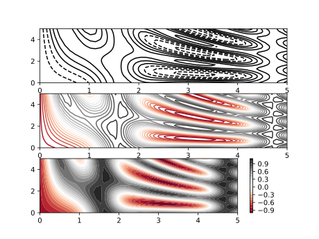

```python
import matplotlib.pyplot as plt
import numpy as np


def f(x, y):
    return np.sin(x)**10 + np.cos(10 + y * x) * np.cos(x)


x = np.linspace(0, 5, 50)
y = np.linspace(0, 5, 40)
X, Y = np.meshgrid(x, y)
Z = f(X, Y)

contours = plt.contour(X, Y, Z, 3, colors='black')
plt.clabel(contours, inline=True, fontsize=8)
plt.imshow(Z, extent=[0, 5, 0, 5], origin='lower', cmap='RdGy', alpha=0.5)
plt.colorbar()
plt.show()
```

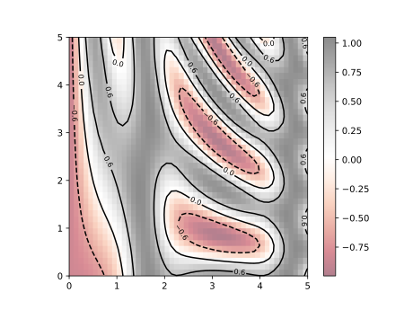

# 绘制3D点线

```python
import matplotlib.pyplot as plt
import numpy as np

ax = plt.axes(projection='3d')

#三维螺旋线的数据
zline = np.linspace(0, 15, 1000)
xline = np.sin(zline)
yline = np.cos(zline)
ax.plot3D(xline, yline, zline, 'gray')

#三维散点的数据
zdata = 15 * np.random.random(100)
xdata = np.sin(zdata) + 0.1 * np.random.randn(100)
ydata = np.cos(zdata) + 0.1 * np.random.randn(100)
ax.scatter3D(xdata, ydata, zdata, c=zdata, cmap='viridis')

plt.show()
```

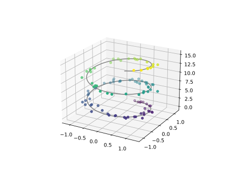

# 绘制3D曲面

函数$f(x,y)=(x+y)e^{-x^2-y^2}$

```python
import matplotlib.pyplot as plt
import numpy as np
import math

def f(x, y):
    return math.e**(-x**2-y**2)*(x+y)

x = np.linspace(-2, 2, 100)
y = np.linspace(-2, 2, 100)

x, y = np.meshgrid(x, y)
z = f(x, y)

# 初始化matplotlib
plt.figure()
plt.rcParams['font.sans-serif'] = ['SimHei']
plt.rcParams['axes.unicode_minus'] = False
# 绘制3D子图
ax1 = plt.subplot(121, projection="3d")
ax1.plot_surface(x, y, z, cmap="viridis")
ax1.set_xlabel("$x$")
ax1.set_ylabel("$y$")
# 绘制等高线子图
ax2 = plt.subplot(122)
ax2.grid()
contr = ax2.contour(x, y, z, 15, cmap="inferno")
ax2.clabel(contr)
plt.show()
```

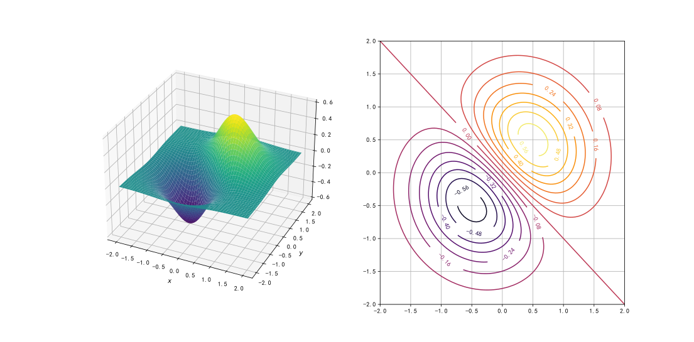

# 直方图

## 一维直方图

> 联合使用`histtype='stepfilled'`和`alpha`参数设置透明度在对不同分布的数据集进行比较展示时很有用
>
> `hist(x, bins=None, range=None, density=False, weights=None, cumulative=False, bottom=None, histtype='bar', align='mid', orientation='vertical', rwidth=None, log=False, color=None, label=None, stacked=False, *, data=None, **kwargs)`
>
> `bin`：设置划分的区间个数
>
> `histtype`：
>
> 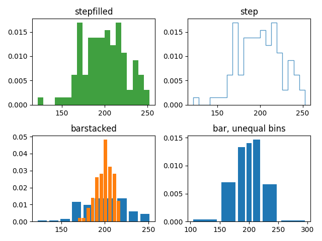

```python
import matplotlib.pyplot as plt
import numpy as np

x1 = np.random.normal(0, 0.8, 1000)
x2 = np.random.normal(-2, 1, 1000)
x3 = np.random.normal(3, 2, 1000)
kwargs = dict(histtype='stepfilled', alpha=0.3, density=True, bins=40)
plt.hist(x1, **kwargs)
plt.hist(x2, **kwargs)
plt.hist(x3, **kwargs)

plt.show()
```

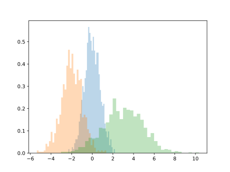

## 2维直方图

```python
import matplotlib.pyplot as plt
import numpy as np

mean = [0, 0]
cov = [[1, 1], [1, 2]]
x, y = np.random.multivariate_normal(mean, cov, 10000).T

plt.hist2d(x, y, bins=30, cmap='Blues')
cb = plt.colorbar()
cb.set_label('counts in bin')
plt.show()
```

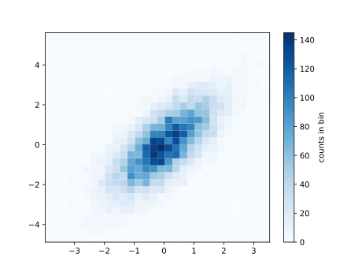

## 六边形直方图

```python
import matplotlib.pyplot as plt
import numpy as np

mean = [0, 0]
cov = [[1, 1], [1, 2]]
x, y = np.random.multivariate_normal(mean, cov, 10000).T

plt.hexbin(x, y, gridsize=30, cmap='Blues')
cb = plt.colorbar(label='count in bin')
plt.show()
```

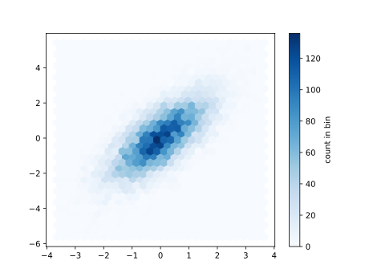

# 子表复杂排列

```python
import matplotlib.pyplot as plt
import numpy as np

grid = plt.GridSpec(2, 3, wspace=0.4, hspace=0.3)
plt.subplot(grid[0, 0])
plt.subplot(grid[0, 1:])
plt.subplot(grid[1, :2])
plt.subplot(grid[1, 2])
plt.show()
```

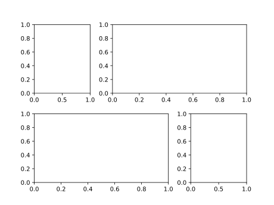

```python
import matplotlib.pyplot as plt
import numpy as np

#构建二维正态分布数据
mean = [0, 0]
cov = [[1, 1], [1, 2]]
x, y = np.random.multivariate_normal(mean, cov, 3000).T
#使用GridSpec创建网格并加入子图表
fig = plt.figure(figsize=(6, 6))
grid = plt.GridSpec(4, 4, hspace=0.2, wspace=0.2)
main_ax = fig.add_subplot(grid[:-1, 1:])
y_hist = fig.add_subplot(grid[:-1, 0], xticklabels=[], sharey=main_ax)
x_hist = fig.add_subplot(grid[-1, 1:], yticklabels=[], sharex=main_ax)
#在主图表中绘制散点图
main_ax.plot(x, y, 'ok', markersize=3, alpha=0.2)
#分别在x轴和y轴方向绘制直方图
x_hist.hist(x, 40, histtype='stepfilled', orientation='vertical', color='gray')
x_hist.invert_yaxis()  # x轴方向(右下)直方图倒转y轴方向
y_hist.hist(y,
            40,
            histtype='stepfilled',
            orientation='horizontal',
            color='gray')
y_hist.invert_xaxis()  # y轴方向(左上)直方图倒转x轴方向
plt.show()
```

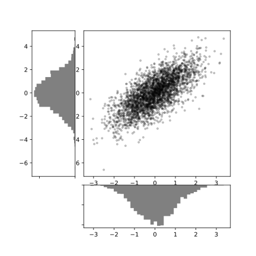

# 动画绘制

|                             函数                             |                             用法                             |
| :----------------------------------------------------------: | :----------------------------------------------------------: |
| [`Animation`](https://matplotlib.org/3.1.1/api/_as_gen/matplotlib.animation.Animation.html#matplotlib.animation.Animation) | This class wraps the creation of an animation using matplotlib. |
| [`FuncAnimation`](https://matplotlib.org/3.1.1/api/_as_gen/matplotlib.animation.FuncAnimation.html#matplotlib.animation.FuncAnimation) | Makes an animation by repeatedly calling a function *func*.  |
| [`ArtistAnimation`](https://matplotlib.org/3.1.1/api/_as_gen/matplotlib.animation.ArtistAnimation.html#matplotlib.animation.ArtistAnimation) |       Animation using a fixed set of `Artist` objects.       |

`FuncAnimation(fig, func, frames, init_func, interval, blit)`

主要参数的含义如下

* `fig`: 绘制动图的画布名称
* `func`: 回调函数，每次更新时调用，即下边程序定义的函数update，可以在这个方法中更新 line2d 对象。
* `frames`: 真个动画 frame 的取值范围，在函数运行时，其值会传递给函数 update(n) 的形参 n。
* `init_func`: 自定义开始帧，即传入刚定义的函数init,初始化函数。
* `interval`: frame之间的更新频率，以 ms 计。
* `blit`: 选择更新所有点，还是仅更新产生变化的点。

**frames**

以上 FuncAnimation 构造函数中的参数中，frames 参数可以取值 iterable, int, generator 或者 None。如果取整数 n，相当于给参数赋值 range(n)

frames 会在 interval 时间内迭代一次，然后将值传给 func，直至 frames 迭代完毕。

**init 与 update**

init 的作用是绘制下一帧画面前清空画布窗口的当前画面。update 的作用是绘制每帧画面

注意 init 和 update 的返回值的逗号不可省略，如果不带逗号，返回的是 list，带了逗号之后，返回的才是 `Line2D` 对象。类似地，`ax.plot` 返回值 line 后面也要加逗号。

**保存 gif 或 mp4**

用 FuncAnimation 生成的动图，如果要存 mp4，需要安装 ffmpeg，如果要存 gif，需要安装 imagemagick

```python
ani.save("animation.mp4", fps=20, writer="ffmpeg")
ani.save("animation.gif", fps=50, writer="imagemagick")
```

## x不变，清空并一次性更新y

```python
import matplotlib.pyplot as plt
import numpy as np
from matplotlib.animation import FuncAnimation

fig = plt.figure()
ax = fig.add_subplot(1, 1, 1)

x = np.linspace(0, 2 * np.pi, 5000)
y = np.exp(-x) * np.cos(2 * np.pi * x)
line, = ax.plot(x, y, color="cornflowerblue", lw=3)
ax.set_ylim(-1.1, 1.1)

# 清空当前帧
def init():
    line.set_ydata([np.nan] * len(x))
    return line,

# 更新新一帧的数据
def update(frame):
    line.set_ydata(np.exp(-x) * np.cos(2 * np.pi * x + float(frame) / 100))
    return line,

# 调用 FuncAnimation
ani = FuncAnimation(fig,
                    update,
                    init_func=init,
                    frames=200,
                    interval=2,
                    blit=True)

ani.save("animation.gif", fps=25, writer="imagemagic")
```

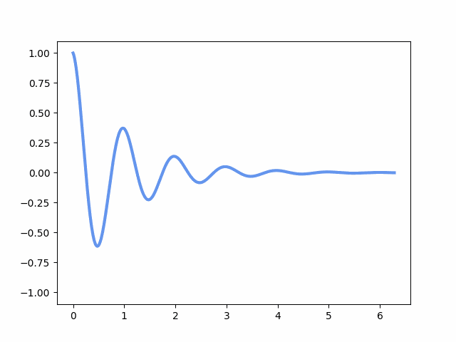

## 新增x和y的点

```python
fig = plt.figure()
ax = fig.add_subplot(1, 1, 1)
line, = plt.plot([], [], "r-", animated=True)
x = []
y = []


def init():
    ax.set_xlim(-np.pi, np.pi)
    ax.set_ylim(-1, 1)
    return line,


def update(frame):
    x.append(frame)
    y.append(np.sin(frame))
    line.set_data(x, y)
    return line,


ani = FuncAnimation(fig,
                    update,
                    frames=np.linspace(-np.pi, np.pi, 90),
                    interval=10,
                    init_func=init,
                    blit=True)

ani.save("animation2.gif", fps=25, writer="imagemagick")
```

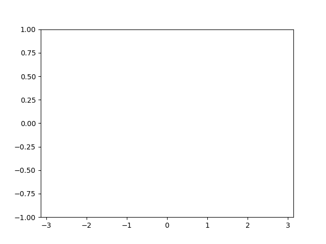

## 同时画两条线

```python
import matplotlib.pyplot as plt
import numpy as np
from matplotlib.animation import FuncAnimation

fig = plt.figure()
ax = fig.add_subplot(1, 1, 1)
x = np.linspace(0, 10, 100)
y1 = np.sin(x)
y2 = np.cos(x)
line1, = ax.plot(x, y1, color='k')
line2, = ax.plot(x, y2, color='b')


def init():
    return line1, line2,


def update(num):
    line1.set_data(x[:num], y1[:num])
    line2.set_data(x[:num], y2[:num])
    return line1, line2


ani = FuncAnimation(fig,
                    update,
                    init_func=init,
                    frames=len(x),
                    interval=25,
                    blit=True)

ani.save("animation3.gif", fps=25, writer="imagemagick")
```

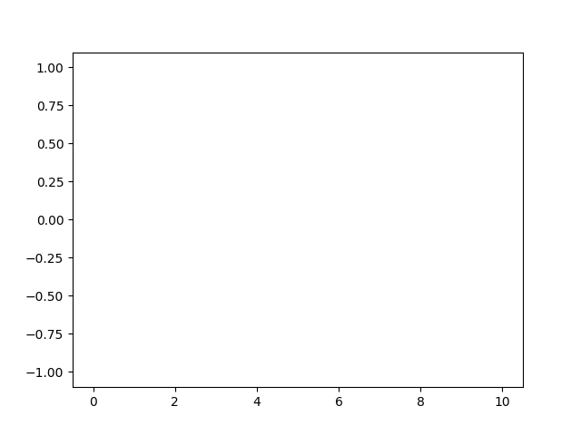

## 绘制单摆模型

```python
from math import sin, cos
import numpy as np
from scipy.integrate import odeint
import matplotlib.pyplot as plt
import matplotlib.animation as animation

g = 9.8
leng = 1.0
b_const = 0.2


# no decay case:
def pendulum_equations1(w, t, l):
    th, v = w
    dth = v
    dv = -g / l * sin(th)
    return dth, dv


# the decay exist case:
def pendulum_equations2(w, t, l, b):
    th, v = w
    dth = v
    dv = -b / l * v - g / l * sin(th)
    return dth, dv


t = np.arange(0, 20, 0.1)
track = odeint(pendulum_equations1, (1.0, 0), t, args=(leng, ))
xdata = [leng * sin(track[i, 0]) for i in range(len(track))]
ydata = [-leng * cos(track[i, 0]) for i in range(len(track))]

fig, ax = plt.subplots()
ax.grid()
line, = ax.plot([], [], 'o-', lw=2)
time_template = 'time = %.1fs'
time_text = ax.text(0.05, 0.9, '', transform=ax.transAxes)


def init():
    ax.set_xlim(-2, 2)
    ax.set_ylim(-2, 2)
    time_text.set_text('')
    return line, time_text


def update(i):
    newx = [0, xdata[i]]
    newy = [0, ydata[i]]
    line.set_data(newx, newy)
    time_text.set_text(time_template % (0.1 * i))
    return line, time_text


ani = animation.FuncAnimation(fig,
                              update,
                              range(1, len(xdata)),
                              init_func=init,
                              interval=50)

ani.save('single_pendulum_nodecay.gif', writer='imagemagick', fps=100)
plt.show()
```

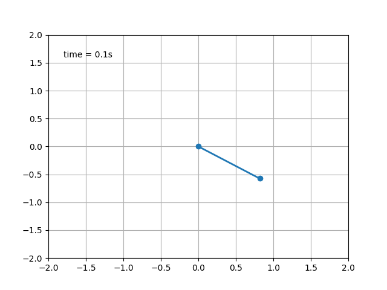
