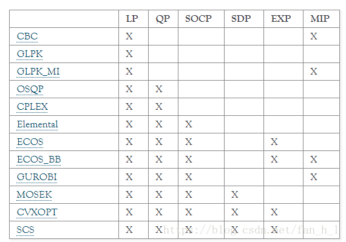

# 简介
> 与[matlab](https://so.csdn.net/so/search?q=matlab&spm=1001.2101.3001.7020)中cvx的工具包类似，用于求解凸优化问题。cvx与cvxpy都是由CIT的Stephen Boyd教授课题组开发。cvx用于matlab的包，cvxpy是用于python的包。
>
> `cvxpy`求解器：
>
> 

#  一般线性规划

求解最优解
$$
\min 2800(x_{11}+x_{21}+x_{31}+x_{41})+4500(x_{12}+x_{22}+x_{32})+6000(x_{13}+x_{23})+7300x_{14},
$$

$$
s.t.
\begin{cases}
x_{11}+x_{12}+x_{13}+x_{14}\ge15,\\
x_{12}+x_{13}+x_{14}+x_{21}+x_{22}+x_{23}\ge10,\\
x_{13}+x_{14}+x_{22}+x_{23}+x_{31}+x_{32}\ge20,\\
x_{14}+x_{23}+x_{32}+x_{41}\ge12,\\
x_{ij}\ge0.
\end{cases}
$$

```python
import cvxpy as cp

# 1 定义可行解x
x = cp.Variable((4, 4), pos=True)
# 2 定义目标函数
obj = cp.Minimize(2800 * sum(x[:, 0]) + 4500 * (sum(x[:3, 1])) +
				  6000 * sum(x[:2, 2]) + 7300 * x[0, 3])
# 3 定义可行域
cons = [
        sum(x[0, :]) >= 15,
		sum(x[0, 1:4]) + sum(x[2, 0:3]) >= 10,
		sum(x[0, 2:4]) + sum(x[1, 1:3]) + sum(x[2, :2]) >= 20,
		x[0, 3] + x[1, 2] + x[2, 1] + x[3, 0] >= 12
		]
# 4 求解
prob = cp.Problem(obj, cons)
prob.solve(solver = 'ECOS')

print(x.value)
print(prob.value)
```

# 整数规划

求最优解
$$
\min \sum_{i=1}^{10}x_i,
$$
$$
s.t.
\begin{cases}
\displaystyle\sum_{i=1}^{10}y_{ij}\ge1,\quad j=1,2,\cdots,10,\\[0.4em]
\displaystyle d_{ij}y_{ij}\le10x_{i},\quad i,j=1,2,\cdots,10,\\[0.4em]
\displaystyle\sum_{j=1}^{10}y_{ij}\le5,\quad i=1,2,\cdots,10,\\[0.4em]
\displaystyle x_{i}\ge y_{ij},\quad i,j=1,2,\cdots,10,\\[0.4em]
\displaystyle x_i=y_{ij},\quad i=1,2,\cdots,10.\\[0.4em]
\displaystyle x_i,\ y_{ij}=0或1,\quad i,j=1,2,\cdots,10.
\end{cases}
$$

```python
import cvxpy as cp
import numpy as np

a = np.array([[9.488,  8.7928, 11.5963, 11.5643,  5.6756,  9.8497,  9.1756,
			  13.1385, 15.4663, 15.5464],
			  [5.6817, 10.3868,  3.9294,  4.4325,  9.9658, 17.6632,  6.1517,
			  11.8569,  8.8721, 15.5868]])

# =============================================================================
# 计算不同点之间的距离
# >> a[:,1]-a[:,2]
# >> array([-2.8035,  6.4574])
# =============================================================================

d = np.zeros((10, 10))
for i in range(10):
	for j in range(10):
		d[i, j] = np.linalg.norm(a[:, i] - a[:, j])

x = cp.Variable(10, integer=True)
y = cp.Variable((10, 10), integer=True)

obj = cp.Minimize(sum(x))

con = [sum(y) >= 1, cp.sum(y, axis=1) <= 5, x >= 0, x <= 1, y >= 0, y <= 1]

for i in range(10):
	con.append(x[i] == y[i, i]) # 确保供应站能够被本身覆盖
	for j in range(10):
		con.append(d[i, j] * y[i, j] <= 10 * x[i])
		con.append(x[i] >= y[i, j])

prob = cp.Problem(obj, con)
prob.solve(solver="GLPK_MI")

print(x.value)
print(prob.value)
```

# 绝对值规划

求最优解
$$
\min z=|x_1|+2|x_2|+3|x_3|+4|x_4|,
$$
$$
s.t.
\begin{cases}
x_1-x_2-x_3+x_4=0,\\
x_1-x_2+x_3-3x_4=1,\\
x_1-x_2-2x_3+3x_4=-\dfrac12.
\end{cases}
$$

```python
import cvxpy as cp
import numpy as np

c = np.arange(1, 5)
a = np.array([[1, -1, -1, 1], [1, -1, 1, -3], [1, -1, -2, 3]])
b = np.array([0, 1, -1/2])
x = cp.Variable(4)
obj = cp.Minimize(c @ cp.abs(x))
con = [a @ x == b]
prob = cp.Problem(obj, con)
prob.solve(solver='GLPK_MI')
print(x.value)
print(prob.value)
```

# 二次规划

求最优解
$$
\max -x_1^2-0.3x_1x_2-2x_2^2+98x_1+277x_2
$$
$$
s.t.
\begin{cases}
x_1+x_2\le100,\\
x_1-2x_2\le0,\\
x_1,\ x_2\ge0.
\end{cases}
$$
化简为：
$$
\max
{\begin{bmatrix}
x_1&x_2
\end{bmatrix}}
{\begin{bmatrix}
-1&-0.15\\
0.15&-2
\end{bmatrix}}
{\begin{bmatrix}
x_1\\x_2
\end{bmatrix}}
+
{\begin{bmatrix}
98&277
\end{bmatrix}}
{\begin{bmatrix}
x_1\\x_2
\end{bmatrix}}
$$
$$
s.t
\begin{cases}
{\begin{bmatrix}
1&1\\
1&-2
\end{bmatrix}}
{\begin{bmatrix}
x_1\\x_2
\end{bmatrix}}
\le
{\begin{bmatrix}
100\\0
\end{bmatrix}}\\[1em]
x_1,\ x_2\ge0.
\end{cases}
$$

```python
import cvxpy as cvx
import numpy as np

c2 = np.array([[-1, -0.15],
			   [-0.15, -2]])

c1 = np.array([98, 277])

a = np.array([[1, 1],
			 [1, -2]])

b = np.array([100, 0])

x = cvx.Variable(2, pos=True)
obj = cvx.Maximize(cvx.quad_form(x, c2)+c1 @ x)
cons = [x >= 0,
	   a @ x <= b]
prob = cvx.Problem(obj, cons)
prob.solve(solver="CVXOPT")

print(x.value)
print(prob.value)
```