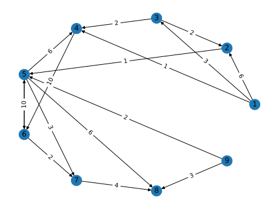

> networkx的结构可以由其源代码的组织看到。该包提供了图形对象类、用于创建标准图形的生成器、用于读取现有数据集的IO例程、用于分析生成的网络的算法和一些基本绘图工具。

1. ```python
   import matplotlib.pyplot as plt
   import networkx as nx
   
   G = nx.DiGraph()
   l = [(1, 2, 6), (1, 3, 3), (1, 4, 1), (2, 5, 1), (3, 2, 2), (3, 4, 2),
        (4, 6, 10), (5, 4, 6), (5, 6, 4), (5, 7, 3), (5, 8, 6), (6, 5, 10),
        (6, 7, 2), (7, 8, 4), (9, 5, 2), (9, 8, 3)]
   G.add_nodes_from(range(1, 10))
   G.add_weighted_edges_from(l)
   path = nx.dijkstra_path(G, 1, 8, weight="weight")
   d = nx.dijkstra_path_length(G, 1, 8, weight="weight")
   print("最短路径：", path)
   print("最短距离：", d)
   
   pos = nx.circular_layout(G)
   nx.draw(G, pos, with_labels=True)
   nx.draw_networkx_edge_labels(G,
                                pos,
                                edge_labels=nx.get_edge_attributes(G, "weight"))
   plt.show()
   ```

   