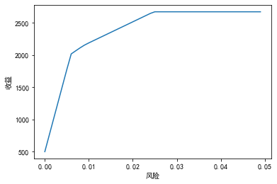

# 一般线性规划模型

>  一般线性规划（数学）标准型为：
> $$
> \max(或\min)\ z=\sum_{j=1}^nc_jx_j,
> $$
>  
> $$
> s.t.
> \begin{cases}
> \displaystyle\sum_{j=1}^na_{ij}x_j=b_i,\quad i=1,2,3,\cdots,m,\\[0.4em]
> x_j\ge0,\quad j=1,2,\cdots,n.
> \end{cases}
> $$
> 其中，$b_i\ge0,i=1,2,\cdots,m$。
>
> 相应库[[6. Cvxpy]]：
>
> * 定义变量
>
>    `x = Variable(shape=(), name: Optional[str]=None, var_id: Optional[int]=None, *, value=None, nonneg: bool=False, nonpos: bool=False, complex: bool=False, imag: bool=False, symmetric: bool=False, diag: bool=False, PSD: bool=False, NSD: bool=False, hermitian: bool=False, boolean: bool=False, integer: bool=False, sparsity=None, pos: bool=False, neg: bool=False)`
>
> * 定义目标函数
>
>    `obj = Maximize(expr)`
>
>    `obj = Minmize(expr)`
>
> * 定义可行域
>
>    `cons = [expr1, expr2, ...]`
>
> * 求解
>
>    `prob = Problem(objective: Union[Minimize, Maximize], constraints: Optional[List[Constraint]]=None)`
>
>    `solve(solver: str=None, warm_start: bool=True, verbose: bool=False, gp: bool=False, qcp: bool=False, requires_grad: bool=False, enforce_dpp: bool=False, ignore_dpp: bool=False, /, *, solver: str=None, warm_start: bool=True, verbose: bool=False, gp: bool=False, qcp: bool=False, requires_grad: bool=False, enforce_dpp: bool=False, ignore_dpp: bool=False, low=None, high=None, eps: float=1e-6, max_iters: int=100, max_iters_interval_search: int=100)`
><center>
> <table>
> <b>scipy.optimize.fminimize求解器</b>
> <tr>
> <td>solver</td>
> <td>功能</td>
> <tr>
> <td>ECOS</td>
> <td>精准求解</td>
> </tr>
> <tr>
> <td>SCS</td>
> <td>快速求解</td>
> </tr>
> <tr>
> <td>OSQP</td>
> <td>大致求解</td>
> </tr>
> </table>
> </center>
> 
> <center><b>Parameter</b>
> <table>
> <tr>
> <td>verbose</td>
> <td>bool</td>
> <td>覆盖隐藏解算器输出的默认值，并打印描述CVXPY编译过程的日志信息。</td>
> </tr>
> <tr>
> <td>gp</td>
> <td>bool</td>
> <td>如果为真，则将问题解析为规则的几何程序，而不是规则的凸程序。</td>
> </tr>
> <tr>
> <td>qcp</td>
> <td>bool</td>
> <td>如果为真，则将问题解析为有纪律的拟凸程序，而不是有纪律的凸程序。</td>
> </tr>
> <tr>
> <td>requires_grad</td>
> <td>bool</td>
> <td>使得在求解后通过调用' '
> problem.backward() ' '来计算与参数相关的解决方案的梯度成为可能，或者通过调用' ' problem.derivative() '
> '来计算对参数给定扰动的变量的<span>扰动。</span></td>
> </tr>
> <tr>
> <td>enforce_dpp</td>
> <td>bool</td>
> <td>当为True时，当试图解决非dpp问题时(而不仅仅是一个警告)将抛出一个DPPError。仅与涉及参数的问题相关。默认值为False。</td>
> </tr>
> <tr>
> <td>ignore_dpp</td>
> <td>bool</td>
> <td>当为True时，DPP问题将被视为非DPP问题，这可能会加快编译速度。默认值为False。</td>
> </tr>
> <tr>
> <td>method</td>
> <td>function</td>
> <td>要使用的自定义解算方法。</td>
> </tr>
> <tr>
> <td>abstol</td>
> <td>float</td>
> <td>误差</td>
> </tr>
>  </table>
>  </center>

1. 捷运公司在下一年度的1~4月份的4个月内拟租用仓库堆放物资。已知各月份所需仓库面积如表所示。仓库租借费用随合同期而定，期限越长，折扣越大，具体见表。租借仓库的合同每月初都可以办理，每份合同具体规定租用面积和期限。因此该公司可根据需要，在任何一个月初办理租借合同。每次办理时可签一份合同，也可以签若干份租用面积和租借期限不同的合同，试确认该公司签订租借合同的最优决策，目的是所付租借费用最小。

   |         月份          |  1   |  2   |  3   |  4   |
   | :-------------------: | :--: | :--: | :--: | :--: |
   | 所需仓库面积$/100m^3$ |  15  |  10  |  20  |  12  |
   |    合同租借期限/月    |  1   |  2   |  3   |  4   |
   |   合同期内的租费/元   | 2800 | 4500 | 6000 | 7300 |

   设变量$x_{ij}$表示该公司在第$i=1,2,3,4$个月初签订的租期为$j=1,2,3,4$个月的仓库面积。因只租借4个月，所以$x_{24}$，$x_{33}$，$x_{34}$，$x_{42}$，$x_{43}$，$x_{44}$皆为0。
   $$
   \min 2800(x_{11}+x_{21}+x_{31}+x_{41})+4500(x_{12}+x_{22}+x_{32})+6000(x_{13}+x_{23})+7300x_{14},
   $$
   $$
   s.t.
   \begin{cases}
   x_{11}+x_{12}+x_{13}+x_{14}\ge15,\\
   x_{12}+x_{13}+x_{14}+x_{21}+x_{22}+x_{23}\ge10,\\
   x_{13}+x_{14}+x_{22}+x_{23}+x_{31}+x_{32}\ge20,\\
   x_{14}+x_{23}+x_{32}+x_{41}\ge12,\\
   x_{ij}\ge0.
   \end{cases}
   $$

   ```python
   import cvxpy as cp
   
   # 1 定义可行解x
   x = cp.Variable((4, 4), pos=True)
   # 2 定义目标函数
   obj = cp.Minimize(2800 * sum(x[:, 0]) + 4500 * (sum(x[:3, 1])) +
                     6000 * sum(x[:2, 2]) + 7300 * x[0, 3])
   # 3 定义可行域
   cons = [
       sum(x[0, :]) >= 15,
       sum(x[0, 1:4]) + sum(x[2, 0:3]) >= 10,
       sum(x[0, 2:4]) + sum(x[1, 1:3]) + sum(x[2, :2]) >= 20,
       x[0, 3] + x[1, 2] + x[2, 1] + x[3, 0] >= 12
   ]
   # 4 求解
   prob = cp.Problem(obj, cons)
   prob.solve(solver = 'ECOS')
   
   print(x.value)
   print(prob.value)
   ```

2. 计算$6$个产地$8$个销地的最小费用运输问题。

   |       | $B_1$ | $B_2$ | $B_3$ | $B_4$ | $B_5$ | $B_6$ | $B_7$ | $B_8$ | 产量 |
   | :---: | :---: | :---: | :---: | :---: | :---: | :---: | :---: | :---: | :--: |
   | $A_1$ |   6   |   2   |   6   |   7   |   4   |   2   |   5   |   9   |  60  |
   | $A_2$ |   4   |   9   |   5   |   3   |   8   |   5   |   8   |   2   |  55  |
   | $A_3$ |   5   |   2   |   1   |   9   |   7   |   4   |   3   |   3   |  51  |
   | $A_4$ |   7   |   6   |   7   |   3   |   9   |   2   |   7   |   1   |  43  |
   | $A_5$ |   2   |   3   |   9   |   5   |   7   |   2   |   6   |   5   |  41  |
   | $A_6$ |   5   |   5   |   2   |   2   |   8   |   1   |   4   |   3   |  52  |
   | 销量  |  35   |  37   |  22   |  32   |  41   |  32   |  43   |  38   |      |

   设$x_{ij}$表示产地$A_i$运到销地$B_j$的量，$c_{ij}$表示产地$A_i$到销地$B_j$的单位运价，$d_j$表示销地$B_j$的销量，$e_i$表示产地$A_i$的产量。
   $$
   \min\sum_{i=1}^6\sum_{j=1}^8c_{ij}x_{ij},
   $$
   $$
   s.t.
   \begin{cases}
   \displaystyle\sum_{i=1}^6x_{ij}\ge d_j,\ j=1,2,\cdots,8,\\[0.1em]
   \displaystyle\sum_{j=1}^8x_{ij}\le e_i,\ i=1,2,\cdots,6,\\[0.4em]
   x_{ij}\ge0.
   \end{cases}
   $$

   ```python
   import cvxpy as cp
   import numpy as np
   
   c = np.array([[6, 2, 6, 7, 4, 2, 5, 9], [4, 9, 5, 3, 8, 5, 8, 2],
                    [5, 2, 1, 9, 7, 4, 3, 3], [7, 6, 7, 3, 9, 2, 7, 1],
                    [2, 3, 9, 5, 7, 2, 6, 5], [5, 5, 2, 2, 8, 1, 4, 3]])
   e = np.array([60, 55, 51, 43, 41, 52])
   d = np.array([35, 37, 22, 32, 41, 32, 43, 38])
   
   x = cp.Variable((6, 8), pos=True)
   
   cons = [cp.sum(x, axis=1) <= e, cp.sum(x, axis=0) >= d]
   obj = cp.Minimize(cp.sum(cp.multiply(c, x)))
   prob = cp.Problem(obj, cons)
   
   prob.solve(solver='ECOS')
   
   print(x.value)
   print(prob.value)
   ```

3. 一架货机有$3$个货舱：前舱、中舱和后舱。$3$个货舱所能装载的货物最大重量和体积限制如表。并且为了飞机的平衡，$3$个货舱装载的货物重量必须与其最大的容许量成正比。

   <center>货舱数据</center>

   |      货舱      | 前舱 | 中舱 | 后舱 |
   | :------------: | :--: | :--: | :--: |
   |  重量限制$/t$  |  10  |  16  |  8   |
   | 体积限制$/m^3$ | 6800 | 8700 | 5300 |
   
   <center>货物规格及其利润表</center>
   
   | 货物  | 重量$/t$ | 空间$/(m^3/t)$ | 利润$/(元/t)$ |
   | :---: | :------: | :------------: | :-----------: |
   | 货物1 |    18    |      480       |     3100      |
   | 货物2 |    15    |      650       |     3800      |
   | 货物3 |    23    |      580       |     3500      |
   | 货物4 |    12    |      390       |     2850      |
   
   假设：
   
   （1）每种货物可以无限细分；
   
   （2）每种货物可以分布在一个或者多个货舱内；
   
   （3）不同的货物可以放在同一个货舱内，并且可以保证不留空隙
   
   试问应如何装运，是货机飞行利润最大？
   
   设$x_{ij}$为第$i=1,2,3,4$种货物在第$j=1,2,3$货舱的重量，$a_i$为货物的总重量，$b_i$为每吨货物所需要的空间数，$c_i$为每吨货物的利润，$d_j$为不同货舱的最大载重，$e_j$为不同货舱的最大空间。
   $$
   \max z=3100\sum_{j=1}^3x_{1j}+3800\sum_{j=1}^3x_{2j}+3500\sum_{j=1}^3x_{3j}+2850\sum_{j=1}^3x_{4j}，
   $$
   $$
   s.t.
   \begin{cases}
   \displaystyle\sum_{i=1}^4b_ix_{ij}\le e_j,\quad j=1,2,3,4,\\
   \displaystyle\sum_{j=1}^3x_{ij}\le a_i,\quad i=1,2,3,4,\\
   \displaystyle\sum_{i=1}^4x_{ij}\le d_j,\quad j=1,2,3,\\[0.3em]
   x_{ij}\ge0,\quad i=1,2,3,4;j=1,2,3.
   \end{cases}
   $$
   
   ```python
   import cvxpy as cp
   import numpy as np
   
   a = np.array([18, 15, 23, 12])
   b = np.array([480, 650, 580, 390])
   c = np.array([3100, 3800, 3500, 2850])
   d = np.array([10, 16, 8])
   e = np.array([6800, 8700, 5300])
   
   x = cp.Variable((4, 3), pos=True)
   
   cons = [b @ x <= e, cp.sum(x, axis=1) <= a, cp.sum(x, axis=0) <= d]
   
   obj=cp.Maximize(cp.sum(c@x))
   
   prob=cp.Problem(obj,cons)
   
   prob.solve(solver='ECOS')
   
   print(x.value)
   print(prob.value)
   ```

# 整数规划

> 整数规划分为三种：
>
> * 纯整数规划：所有决策变量取整
>
> * 混合整数规划：决策变量部分为整数，部分为小数
>
> * 0-1整数规划：决策变量只能取0或1
>
> 数学模型：
> $$
> \max(或\min)\ z=\sum_{j=1}^nc_jx_j,
> $$
> $$
> s.t.
> \begin{cases}
> \displaystyle\sum_{j=1}^na_{ij}x_j\le(或=,\ge)b_i,\quad i=1,2,\cdots,m,\\[0.3em]
> \displaystyle x_j\ge0,\quad j=1,2,\cdots,n,\\[0.3em]
> x_1,x_2,\cdots,x_n\ 中部分或全部整数
> \end{cases}
> $$
>
> 注意：
>
> * `cp.Variable(shape, integer = True)`
>
> * `prob.solve(solver = 'GLPK_MI')`或者`cp.CPLEX`
>
>   相对应先安装`cvxopt`和`CPLEX`

1. 为了生产的需要，某工厂的一条生产线需要每天24h不间断运转，但是每天不同时间段所需要的工人最低数量不同，具体数据如表。已知每名工人的连续工作时间为8h。则该工厂应该为该生产线配备多少名工人，才能保证生产线的正常运转？

   <center><b>工人数量需求表</b>
   <table>
   <thread>
    <tr>
     <td>班次</td>
     <td>1</td>
     <td>2</td>
     <td>3</td>
     <td>4</td>
     <td>5</td>
     <td>6</td>
    </tr>
    </thread>
    <tr>
     <td>时间段</td>
     <td>0:00-4:00</td>
     <td>4:00-8:00</td>
     <td>8:00-12:00</td>
     <td>12:00-16:00</td>
     <td>16:00-20:00</td>
     <td>20:00-24:00</td>
    </tr>
    <tr>
     <td>工人数量</td>
     <td>35</td>
     <td>40</td>
     <td>50</td>
     <td>45</td>
     <td>55</td>
     <td>30</td>
    </tr>
   </table>
   </center>

   设$x_i$为不同的班次$i=1,2,3,4,5,6$上班的人数。
   $$
   \min z=\sum_{i=1}^6x_i，
   $$
   $$
   s.t.
   \begin{cases}
   x_6+x_1\ge35,\\
   x_1+x_2\ge40,\\
   x_2+x_3\ge50,\\
   x_3+x_4\ge45,\\
   x_4+x_5\ge55,\\
   x_5+x_6\ge30,\\
   x_i\ge0且为整数,\quad i=1,2,\cdots,6.
   \end{cases}
   $$

   ```python
   import cvxpy as cp
   
   x = cp.Variable(6, integer=True)
   
   cons = [
       x[0] + x[5] >= 35, x[0] + x[1] >= 40, x[1] + x[2] >= 50, x[2] + x[3] >= 45,
       x[3] + x[4] >= 55, x[4] + x[5] >= 30
   ]
   
   obj = cp.Minimize(cp.sum(x))
   
   prob = cp.Problem(obj, cons)
   
   prob.solve(solver=cp.CPLEX)
   
   print(x.value)
   print(prob.value)
   ```

2. 已知10个网点的坐标如图所示，现要在10个网点中选择适当位置设置网点，要求供应站只能覆盖$10km$之内的网点，且每个供应站最多供应5个网点，求最小供应站的个数。

   <center>商业网点的x坐标和y坐标数据
   <table>
    <tr>
     <td>x</td>
     <td>9.4888</td>
     <td>8.7928</td>
     <td>11.596</td>
     <td>11.5643</td>
     <td>5.6756</td>
     <td>9.8497</td>
     <td>9.1756</td>
     <td>13.1385</td>
     <td>15.4663</td>
     <td>15.5464</td>
    </tr>
    <tr>
     <td>y</td>
     <td>5.6817</td>
     <td>10.3868</td>
     <td>3.9294</td>
     <td>4.4325</td>
     <td>9.9658</td>
     <td>17.6632</td>
     <td>6.1517</td>
     <td>11.8569</td>
     <td>8.8721</td>
     <td>15.5868</td>
    </tr>
   </table>
   </center>

   设$d_{ij}(i=1,2,\cdots,10)$表示第$i$个营业网点与第$j$个营业网点之间的距离，引进0-1变量
   $$
   x_i=
   \begin{cases}
   1,\quad 第i个网点建立供应站,\\
   0,\quad 第i个网点不建立供应站.
   \end{cases},
   $$
   $$
   y_{ij}
   \begin{cases}
   1,\quad 第j个网点被第i个网点的供应站覆盖,\\
   0,\quad 第j个网点不被第i个网点的供应站覆盖,
   \end{cases}
   $$
   
   目标函数是使供应链的个数最小，即
   $$
   \min\sum_{i=1}^{10}x_i.
   $$
   约束条件分为下列4类：
   
   * 每个网点至少由一个供应站覆盖，则有
     $$
     \sum_{i=1}^{10}y_{ij}\ge1,\quad j=1,2,\cdots,10.
     $$
   
   * 要求供应站只能覆盖$10km$之内的网点，则有
     $$
     d_{ij}y_{ij}\le10x_{i},\quad i,j=1,2,\cdots,10.
     $$
   
   * 每个供应站最多供应5个网点，则有
     $$
     \sum_{j=1}^{10}y_{ij}\le5,\quad i=1,2,\cdots,10.
     $$
     
   * 两组决策变量的关联关系有
     $$
     x_{i}\ge y_{ij},\quad i,j=1,2,\cdots,10,\\
     x_i=y_{ij},i=1,2,\cdots,10.
     $$
     
   
   建立0-1的整数规划模型：
   $$
   \min \sum_{i=1}^{10}x_i,
   $$
   $$
   s.t.
   \begin{cases}
   \displaystyle\sum_{i=1}^{10}y_{ij}\ge1,\quad j=1,2,\cdots,10,\\[0.4em]
   \displaystyle d_{ij}y_{ij}\le10x_{i},\quad i,j=1,2,\cdots,10,\\[0.4em]
   \displaystyle\sum_{j=1}^{10}y_{ij}\le5,\quad i=1,2,\cdots,10,\\[0.4em]
   \displaystyle x_{i}\ge y_{ij},\quad i,j=1,2,\cdots,10,\\[0.4em]
   \displaystyle x_i=y_{ij},\quad i=1,2,\cdots,10.\\[0.4em]
   \displaystyle x_i,\ y_{ij}=0或1,\quad i,j=1,2,\cdots,10.
   \end{cases}
   $$
   
   
   ```python
   import cvxpy as cp
   import numpy as np
   
   a = np.array([[9.488,  8.7928, 11.5963, 11.5643,  5.6756,  9.8497,  9.1756,
                  13.1385, 15.4663, 15.5464],
                 [5.6817, 10.3868,  3.9294,  4.4325,  9.9658, 17.6632,  6.1517,
                  11.8569,  8.8721, 15.5868]])
   
   # =============================================================================
   # 计算不同点之间的距离
   # >> a[:,1]-a[:,2]
   # >> array([-2.8035,  6.4574])
   # =============================================================================
   
   d = np.zeros((10, 10))
   for i in range(10):
       for j in range(10):
           d[i, j] = np.linalg.norm(a[:, i] - a[:, j])
   
   x = cp.Variable(10, integer=True)
   y = cp.Variable((10, 10), integer=True)
   
   obj = cp.Minimize(sum(x))
   
   con = [sum(y) >= 1, cp.sum(y, axis=1) <= 5, x >= 0, x <= 1, y >= 0, y <= 1]
   
   for i in range(10):
       con.append(x[i] == y[i, i]) # 确保供应站能够被本身覆盖
       for j in range(10):
           con.append(d[i, j] * y[i, j] <= 10 * x[i])
           con.append(x[i] >= y[i, j])
   
   prob = cp.Problem(obj, con)
   prob.solve(solver="GLPK_MI")
   
   print(x.value)
   print(prob.value)
   ```

# 投资的收益与风险

1. 市场上有$n$种资产（如股票、债券、……）$s_i(i=1,2,\cdots,n)$供投资者选择，某公司有数额为$M$的一笔相当大的资金可用作一个时期的投资。公司财务分析人员对这$n$种资产进行了评估，估算出在这一时期内购买资产$s_i$的平均收益率为$r_i$，并预测出购买$s_i$的风险损失率为$q_i$。考虑到投资越分散，总的风险越小，公司确定，当用这笔资金购买若干种资产时，总体风险可用所投资的s中最大的一个风险来度量。
   购买$s_i$要付交易费，费率为$p_i$，并且当购买额不超过给定值$u_i$时，交易费按购买$u_i$计算（不买当然无须付费）。另外，假设同期银行存款利率是$r_0(r_0=5\%)$，且既无交易费又无风险。
   已知$n=4$时的相关数据如表所列。

   | $s_i$ | $r_i/\%$ | $q_i/\%$ | $p_i/\%$ | $u_i/元$ |
   | :---: | :------: | :------: | :------: | :------: |
   | $s_1$ |    28    |   2.5    |    1     |   103    |
   | $s_2$ |    21    |   1.5    |    2     |   198    |
   | $s_3$ |    23    |   5.5    |   4.5    |    52    |
   | $s_4$ |    25    |   2.6    |   6.5    |    40    |

   模型建立：

   * 总体风险用投资中最大的一个风险来衡量：
     $$
     \max \{q_ix_i|i=1,2,\cdots,n\}.
     $$
   
   * 交易费是一个分段函数：
     $$
     \begin{cases}
     p_ix_i,\quad x_i>u_i,\\
     p_iu_i,\quad 0<x_i\le u_i,\\
     0,\quad x_i=0.
     \end{cases}
     $$
     
   
   目标函数：
   $$
   \begin{cases}
   \displaystyle\max\sum_{i=0}^n(r_i-p_i)x_i,\\[0.5em]
   \min\{\max\limits_{1\le i\le n}\ \{q_ix_i\}\}.
   \end{cases}
   $$
   约束条件：
   $$
   \begin{cases}
   \displaystyle\sum_{i=0}^n(1+p_i)x_i=M.\\
   x_i\ge0,\quad i=0,1,\cdots,n.
   \end{cases}
   $$
   简化模型：
   
   给定风险一个界限$a$，使最大的一个风险$\dfrac{q_ix_i}{M}\le a$，可找到相应的投资方案，将多目标规划变为一个目标的线性规划。
   $$
   \displaystyle\max\sum_{i=0}^n(r_i-p_i)x_i,
   $$
   $$
   s.t.
   \begin{cases}
   \dfrac{q_ix_i}{M}\le a,\\[0.1em]
   \displaystyle\sum_{i=0}^n(1+p_i)x_i=M,
   \end{cases}
   $$
   
   ```python
   import cvxpy as cp
   import numpy as np
   import matplotlib.pyplot as plt
   
   r = np.array([28, 21, 23, 25, 5])*0.01
   q = np.array([2.5, 1.5, 5.5, 2.6, 0])*0.01
   p = np.array([1, 2, 4.5, 6.5, 0])*0.01
   u = np.array([103, 198, 52, 40, 0])
   M = 10000
   a = 0
   y_axis = []
   x_axis = []
   
   x = cp.Variable(5, pos=True)
   
   obj = cp.Maximize((r-p)@x)
   
   while a < 0.05:
       cons = [(1+p)@x == M,
               cp.multiply(q, x) <= a*M]
       prob = cp.Problem(obj, cons)
       prob.solve(solver='ECOS')
       y_axis.append(prob.value)
       x_axis.append(a)
       a += 0.001
   
   # =============================================================================
   # 绘制图像
   # =============================================================================
   plt.rc('font', family='SimHei')
   y_axis = np.array(y_axis)
   x_axis-np.array(x_axis)
   plt.plot(x_axis, y_axis)
   plt.ylabel('收益')
   plt.xlabel('风险')
   plt.show()
   ```
   
   

   在$a=0.6\%$附近有一个转折点，在这一点左边，风险增加很少时，利润增长很快。在这一点右边，风险增加很大时，利润增长很缓慢，所以对于风险和收益没有特殊偏好的投资者来说，应该选择曲线的转折点作为最优投资组合，大约是$a=0.6\%$，$Q=2000$。

# 旅行商问题（TSP）

> * 决策变量：
>
>   对每一座城市$v_i$，$v_j$，定义一个变量$x_{ij}$来表示是否要从$v_i$出发访问$v_j$，令
>
>   $$
>   x_{ij}
>   \begin{cases}
>   1,\quad 推销员决定从v_i直接进入v_j,\\
>   0,\quad 推销员决定不从v_i直接进入v_j.
>   \end{cases}
>   $$
>   式中：$i,j=1,2,\cdots,n$。
>
> * 目标函数：
>
>   若推销员决定从$v_i$直接进入$v_j$，则由已知，其旅行费用为$c_{ij}x_{ij}$，总旅行表达为
>   $$
>   z=\sum_{i=1}^n\sum_{j=1}^nc_{ij}x_{ij},
>   $$
>
> * 约束：
>
>   > （1）每个城市恰好进入一次：
>   > $$
>   > \sum_{i=1}^nx_{ij}=1,\quad j=1,2,\cdots,n.
>   > $$
>   > （2）每个城市离开一次：
>   > $$
>   > \sum_{j=1}^nx_{ij}=1,\quad i=1,2,\cdots,n.
>   > $$
>   > （3）为了防止遍历过程中出现子回路，附加一个强制性约束：
>   > $$
>   > u_i-u_j+nx_{ij}\le n-1,\quad i,j=1,2,\cdots,n.\tag{2.4. 1}\\
>   > $$
>   > ​          式中:$u_1=0,1\le u_i\le n-1,\quad i=1,2,\cdots,n$
>   >
>   > （4）每个城市不能同时被进出：
>   > $$
>   > x_{ij}=0,\quad i=j=1,2,\cdots,n.
>   > $$
>
> 综上，建立**TSP**模型：
> $$
> z=\sum_{i=1}^n\sum_{j=1}^nc_{ij}x_{ij}\ ,
> $$
> $$
> s.t.
> \begin{cases}
> \displaystyle\sum_{i=1}^nx_{ij}=1,\quad j=1,2,\cdots,n,\\
> \displaystyle\sum_{j=1}^nx_{ij}=1,\quad i=1,2,\cdots,n,\\
> \displaystyle u_i-u_j+nx_{ij}\le n-1,\quad i=1,\cdots,n,j=2,\cdots,n,\\[0.4em]
> \displaystyle u_1=0,1\le u_i\le n-1,\quad i=1,2,\cdots,n,\\[0.4em]
> \displaystyle x_{ij}=0,\quad i=j=1,2,\cdots,n,\\[0.4em]
> \displaystyle x_{ij}=0或1,\quad i,j=1,2,\cdots,n.
> \end{cases}
> $$
>
> > **下面证明：**
> > （1）任何含子回路的路线都必然不满足约束条件式（2.4. 1）（不管$u_i$如何取值）。
> > （2）全部不含子回路的整体巡回路线都可以满足约束条件式（2.4. 1）（只要$u_i$取适当值）。
> > **证明：**
> >
> > 用反证法证明（1），假设存在子回路，则至少有两个子回路。那么至少有一个子回路中不含起点$v_1$，例如子回路$v_4\rightarrow v_5\rightarrow v_6\rightarrow v_4$，式（4. 1）用于该子回路，必有
> > $$
> > u_4-u_5+n\le n-1,u_5-u_6+n\le n-1,u_6-u_4+n\le n-1,
> > $$
> > 把这3个不等式加起来得到$0\le-3$，这不可能，故假设不能成立。而对整体巡回，因为约束式（4. 1）中$j≥2$，不包含起点$v_1$故不会发生矛盾。
> > （2）对于整体巡回路线，只要$u_i$取适当值，都可以满足该约束条件：①对于总巡回上的边，$x_{ij}=1$，$u_i$，取整数：起点编号$u_1=0$，第1个到达顶点的编号$u_2=1$，每到达一个顶点，编号加1，则必有$u_i-u_j=-1$，约束式（2.4. 1）变成$-1+n\le n-1$，必然成立。②对于非总巡回上的边，因为$x_{ij}=0$，约束条件式（2.4. 1）变成：$u_i-u_j\le n-1$，肯定成立。
> > 综上所述，约束条件式（2.4. 1）只限制子回路，不影响其他约束条件，于是旅行商问题模型转化为一个整数线性规划模型。
> 
> ```python
> # =============================================================================
> # 遗传算法 -- 旅行商问题（TSP / Traveling Salesman Problem）
> # 要求：
> # 1. 所走路程最近
> # 2. 每个城市只能访问一次
> # 3. 从某个城市出发最后回到该城市（闭环）
> # =============================================================================
> 
> import cvxpy as cp
> import numpy as np
> import matplotlib.pyplot as plt
> import pandas as pd
> 
> # =============================================================================
> # 设置numpy随机数种子和matplotlib显示格式
> # =============================================================================
> plt.rc('font', family='SimHei')
> np.random.seed(2)
> 
> # =============================================================================
> # 随机生成城市信息，绘制城市相对位置
> # =============================================================================
> city_num = 10
> city_location = np.random.random((city_num, 2))
> plt.plot(city_location[:, 0], city_location[:, 1], 'o')
> plt.title('城市坐标')
> plt.show()
> 
> # =============================================================================
> # 计算城市之间的距离
> # =============================================================================
> cite_distance = np.zeros((city_num, city_num))
> for i in range(city_num):
> for j in range(city_num):
> 	cite_distance[i, j] = np.linalg.norm(city_location[i, :]-city_location[j, :])
> 
> # =============================================================================
> # 利用cvxpy求解问题
> # =============================================================================
> x = cp.Variable((city_num, city_num), integer=True)
> obj = cp.Minimize(cp.sum(cp.multiply(cite_distance, x)))
> cons = [x >= 0, x <= 1, cp.sum(x, axis=0) == 1, cp.sum(x, axis=1) == 1]
> for i in range(city_num):
> '''令x_{ij} = 0，其中i = j'''
> cons.append(x[i, i] == 0)
> 
> # =============================================================================
> # 消除子回路
> # =============================================================================
> u = cp.Variable(city_num)
> cons.append(u[0] == 0)
> for i in range(city_num):
> for j in range(1, city_num):
> 	cons.append(u[i]-u[j]+city_num * x[i, j] <= city_num-1)
> 
> prob = cp.Problem(obj, cons)
> prob.solve(solver='GLPK_MI')
> print(prob.value)
> print(x.value)
> res = pd.DataFrame(x.value)
> ```

1. 在各种运动比赛中，为了使比赛公平、公正、合理地举行，一个基本要求是：在比赛项目排序过程中，尽可能使每个运动员不连续参加两项比赛，以便运动员恢复体力，发挥正常水平。
   下表所列为某个小型运动会的比赛报名表。有14个比赛项目，40名运动员参加比赛。表中第1行表示14个比赛项目，第1列表示40名运动员，表中“1”位置表示运动员参加此项比赛。建立此问题的数学模型，要求合理安排比赛项目顺序，使连续参加两项比赛的运动员人次尽可能地少。

   <center><b>某小型运动会的比赛报名表</b>
   <table>
    <tr>
     <td></td>
     <td>1</td>
     <td>2</td>
     <td>3</td>
     <td>4</td>
     <td>5</td>
     <td>6</td>
     <td>7</td>
     <td>8</td>
     <td>9</td>
     <td>10</td>
     <td>11</td>
     <td>12</td>
     <td>13</td>
     <td>14</td>
    </tr>
    <tr>
     <td>1</td>
     <td>　</td>
     <td>1</td>
     <td>1</td>
     <td>　</td>
     <td>　</td>
     <td>　</td>
     <td>　</td>
     <td>　</td>
     <td>1</td>
     <td>　</td>
     <td>　</td>
     <td>　</td>
     <td>1</td>
     <td>　</td>
    </tr>
    <tr>
     <td>2</td>
     <td>　</td>
     <td>　</td>
     <td>　</td>
     <td>　</td>
     <td>　</td>
     <td>　</td>
     <td>　</td>
     <td>1</td>
     <td>　</td>
     <td>　</td>
     <td>1</td>
     <td>1</td>
     <td>　</td>
     <td>　</td>
    </tr>
    <tr>
     <td>3</td>
     <td>　</td>
     <td>1</td>
     <td>　</td>
     <td>1</td>
     <td>　</td>
     <td>　</td>
     <td>　</td>
     <td>　</td>
     <td>　</td>
     <td>1</td>
     <td>　</td>
     <td>　</td>
     <td>　</td>
     <td>　</td>
    </tr>
    <tr>
     <td>4</td>
     <td>　</td>
     <td>　</td>
     <td>1</td>
     <td>　</td>
     <td>　</td>
     <td>　</td>
     <td>　</td>
     <td>1</td>
     <td>　</td>
     <td>　</td>
     <td>　</td>
     <td>1</td>
     <td>　</td>
     <td>　</td>
    </tr>
    <tr>
     <td>5</td>
     <td>　</td>
     <td>　</td>
     <td>　</td>
     <td>　</td>
     <td>　</td>
     <td>　</td>
     <td>　</td>
     <td>　</td>
     <td>　</td>
     <td>　</td>
     <td>1</td>
     <td>　</td>
     <td>1</td>
     <td>1</td>
    </tr>
    <tr>
     <td>6</td>
     <td>　</td>
     <td>　</td>
     <td>　</td>
     <td>　</td>
     <td>1</td>
     <td>1</td>
     <td>　</td>
     <td>　</td>
     <td>　</td>
     <td>　</td>
     <td>　</td>
     <td>　</td>
     <td>　</td>
     <td>　</td>
    </tr>
    <tr>
     <td>7</td>
     <td>　</td>
     <td>　</td>
     <td>　</td>
     <td>　</td>
     <td>　</td>
     <td>　</td>
     <td>　</td>
     <td>　</td>
     <td>　</td>
     <td>　</td>
     <td>　</td>
     <td>1</td>
     <td>1</td>
     <td>　</td>
    </tr>
    <tr>
     <td>8</td>
     <td>　</td>
     <td>　</td>
     <td>　</td>
     <td>　</td>
     <td>　</td>
     <td>　</td>
     <td>　</td>
     <td>　</td>
     <td>　</td>
     <td>1</td>
     <td>　</td>
     <td>　</td>
     <td>　</td>
     <td>1</td>
    </tr>
    <tr>
     <td>9</td>
     <td>　</td>
     <td>1</td>
     <td>　</td>
     <td>1</td>
     <td>　</td>
     <td>　</td>
     <td>　</td>
     <td>　</td>
     <td>　</td>
     <td>1</td>
     <td>1</td>
     <td>　</td>
     <td>　</td>
     <td>　</td>
    </tr>
    <tr>
     <td>10</td>
     <td>1</td>
     <td>1</td>
     <td>　</td>
     <td>1</td>
     <td>　</td>
     <td>　</td>
     <td>1</td>
     <td>　</td>
     <td>　</td>
     <td>　</td>
     <td>　</td>
     <td>　</td>
     <td>　</td>
     <td>　</td>
    </tr>
    <tr>
     <td>11</td>
     <td>　</td>
     <td>1</td>
     <td>　</td>
     <td>1</td>
     <td>　</td>
     <td>　</td>
     <td>　</td>
     <td>　</td>
     <td>　</td>
     <td>　</td>
     <td>　</td>
     <td>　</td>
     <td>1</td>
     <td>1</td>
    </tr>
    <tr>
     <td>12</td>
     <td>　</td>
     <td>　</td>
     <td>　</td>
     <td>　</td>
     <td>　</td>
     <td>　</td>
     <td>　</td>
     <td>1</td>
     <td>　</td>
     <td>1</td>
     <td>　</td>
     <td>　</td>
     <td>　</td>
     <td>　</td>
    </tr>
    <tr>
     <td>13</td>
     <td>　</td>
     <td>　</td>
     <td>　</td>
     <td>　</td>
     <td>1</td>
     <td>　</td>
     <td>　</td>
     <td>　</td>
     <td>　</td>
     <td>1</td>
     <td>　</td>
     <td>　</td>
     <td>　</td>
     <td>1</td>
    </tr>
    <tr>
     <td>14</td>
     <td>　</td>
     <td>　</td>
     <td>1</td>
     <td>1</td>
     <td>　</td>
     <td>　</td>
     <td>　</td>
     <td>1</td>
     <td>　</td>
     <td>　</td>
     <td>　</td>
     <td>　</td>
     <td>　</td>
     <td>　</td>
    </tr>
    <tr>
     <td>15</td>
     <td>　</td>
     <td>　</td>
     <td>1</td>
     <td>　</td>
     <td>　</td>
     <td>　</td>
     <td>　</td>
     <td>1</td>
     <td>　</td>
     <td>　</td>
     <td>　</td>
     <td>1</td>
     <td>　</td>
     <td>　</td>
    </tr>
    <tr>
     <td>16</td>
     <td>　</td>
     <td>　</td>
     <td>　</td>
     <td>　</td>
     <td>　</td>
     <td>　</td>
     <td>　</td>
     <td>　</td>
     <td>1</td>
     <td>　</td>
     <td>1</td>
     <td>1</td>
     <td>　</td>
     <td>　</td>
    </tr>
    <tr>
     <td>17</td>
     <td>　</td>
     <td>　</td>
     <td>　</td>
     <td>　</td>
     <td>　</td>
     <td>1</td>
     <td>　</td>
     <td>　</td>
     <td>　</td>
     <td>　</td>
     <td>　</td>
     <td>　</td>
     <td>　</td>
     <td>1</td>
    </tr>
    <tr>
     <td>18</td>
     <td>　</td>
     <td>　</td>
     <td>　</td>
     <td>　</td>
     <td>　</td>
     <td>　</td>
     <td>1</td>
     <td>　</td>
     <td>　</td>
     <td>　</td>
     <td>　</td>
     <td>1</td>
     <td>　</td>
     <td>　</td>
    </tr>
    <tr>
     <td>19</td>
     <td>　</td>
     <td>　</td>
     <td>1</td>
     <td>　</td>
     <td>　</td>
     <td>　</td>
     <td>　</td>
     <td>　</td>
     <td>　</td>
     <td>1</td>
     <td>　</td>
     <td>　</td>
     <td>　</td>
     <td>　</td>
    </tr>
    <tr>
     <td>20</td>
     <td>1</td>
     <td>　</td>
     <td>1</td>
     <td>　</td>
     <td>　</td>
     <td>　</td>
     <td>　</td>
     <td>　</td>
     <td>　</td>
     <td>　</td>
     <td>　</td>
     <td>　</td>
     <td>　</td>
     <td>　</td>
    </tr>
    <tr>
     <td>21</td>
     <td>　</td>
     <td>　</td>
     <td>　</td>
     <td>　</td>
     <td>　</td>
     <td>　</td>
     <td>　</td>
     <td>　</td>
     <td>1</td>
     <td>　</td>
     <td>　</td>
     <td>　</td>
     <td>　</td>
     <td>1</td>
    </tr>
    <tr>
     <td>22</td>
     <td>　</td>
     <td>1</td>
     <td>　</td>
     <td>　</td>
     <td>1</td>
     <td>　</td>
     <td>　</td>
     <td>　</td>
     <td>　</td>
     <td>　</td>
     <td>　</td>
     <td>　</td>
     <td>　</td>
     <td>　</td>
    </tr>
    <tr>
     <td>23</td>
     <td>　</td>
     <td>　</td>
     <td>　</td>
     <td>　</td>
     <td>　</td>
     <td>　</td>
     <td>1</td>
     <td>　</td>
     <td>　</td>
     <td>　</td>
     <td>　</td>
     <td>1</td>
     <td>　</td>
     <td>　</td>
    </tr>
    <tr>
     <td>24</td>
     <td>　</td>
     <td>　</td>
     <td>　</td>
     <td>　</td>
     <td>　</td>
     <td>　</td>
     <td>1</td>
     <td>1</td>
     <td>　</td>
     <td>　</td>
     <td>　</td>
     <td>　</td>
     <td>1</td>
     <td>1</td>
    </tr>
    <tr>
     <td>25</td>
     <td>1</td>
     <td>1</td>
     <td>　</td>
     <td>　</td>
     <td>　</td>
     <td>　</td>
     <td>　</td>
     <td>　</td>
     <td>　</td>
     <td>1</td>
     <td>　</td>
     <td>　</td>
     <td>　</td>
     <td>　</td>
    </tr>
    <tr>
     <td>26</td>
     <td>　</td>
     <td>　</td>
     <td>　</td>
     <td>　</td>
     <td>1</td>
     <td>　</td>
     <td>　</td>
     <td>　</td>
     <td>　</td>
     <td>　</td>
     <td>　</td>
     <td>　</td>
     <td>　</td>
     <td>1</td>
    </tr>
    <tr>
     <td>27</td>
     <td>　</td>
     <td>　</td>
     <td>　</td>
     <td>　</td>
     <td>　</td>
     <td>1</td>
     <td>　</td>
     <td>　</td>
     <td>　</td>
     <td>　</td>
     <td>1</td>
     <td>　</td>
     <td>　</td>
     <td>　</td>
    </tr>
    <tr>
     <td>28</td>
     <td>　</td>
     <td>1</td>
     <td>　</td>
     <td>　</td>
     <td>　</td>
     <td>　</td>
     <td>　</td>
     <td>1</td>
     <td>　</td>
     <td>　</td>
     <td>　</td>
     <td>　</td>
     <td>　</td>
     <td>　</td>
    </tr>
    <tr>
     <td>29</td>
     <td>1</td>
     <td>　</td>
     <td>　</td>
     <td>　</td>
     <td>　</td>
     <td>　</td>
     <td>　</td>
     <td>　</td>
     <td>　</td>
     <td>　</td>
     <td>1</td>
     <td>1</td>
     <td>　</td>
     <td>　</td>
    </tr>
    <tr>
     <td>30</td>
     <td>　</td>
     <td>　</td>
     <td>　</td>
     <td>1</td>
     <td>1</td>
     <td>　</td>
     <td>　</td>
     <td>　</td>
     <td>　</td>
     <td>　</td>
     <td>　</td>
     <td>　</td>
     <td>　</td>
     <td>　</td>
    </tr>
    <tr>
     <td>31</td>
     <td>　</td>
     <td>　</td>
     <td>　</td>
     <td>　</td>
     <td>　</td>
     <td>1</td>
     <td>　</td>
     <td>1</td>
     <td>　</td>
     <td>　</td>
     <td>　</td>
     <td>1</td>
     <td>　</td>
     <td>　</td>
    </tr>
    <tr>
     <td>32</td>
     <td>　</td>
     <td>　</td>
     <td>　</td>
     <td>　</td>
     <td>　</td>
     <td>　</td>
     <td>1</td>
     <td>　</td>
     <td>　</td>
     <td>1</td>
     <td>　</td>
     <td>　</td>
     <td>　</td>
     <td>　</td>
    </tr>
    <tr>
     <td>33</td>
     <td>　</td>
     <td>　</td>
     <td>　</td>
     <td>1</td>
     <td>　</td>
     <td>1</td>
     <td>　</td>
     <td>　</td>
     <td>　</td>
     <td>　</td>
     <td>　</td>
     <td>　</td>
     <td>　</td>
     <td>　</td>
    </tr>
    <tr>
     <td>34</td>
     <td>1</td>
     <td>　</td>
     <td>1</td>
     <td>　</td>
     <td>　</td>
     <td>　</td>
     <td>　</td>
     <td>　</td>
     <td>　</td>
     <td>　</td>
     <td>　</td>
     <td>　</td>
     <td>1</td>
     <td>1</td>
    </tr>
    <tr>
     <td>35</td>
     <td>　</td>
     <td>　</td>
     <td>　</td>
     <td>1</td>
     <td>1</td>
     <td>　</td>
     <td>　</td>
     <td>　</td>
     <td>　</td>
     <td>　</td>
     <td>　</td>
     <td>1</td>
     <td>　</td>
     <td>　</td>
    </tr>
    <tr>
     <td>36</td>
     <td>　</td>
     <td>　</td>
     <td>　</td>
     <td>1</td>
     <td>　</td>
     <td>　</td>
     <td>1</td>
     <td>　</td>
     <td>　</td>
     <td>　</td>
     <td>　</td>
     <td>　</td>
     <td>　</td>
     <td>　</td>
    </tr>
    <tr>
     <td>37</td>
     <td>1</td>
     <td>　</td>
     <td>　</td>
     <td>　</td>
     <td>　</td>
     <td>　</td>
     <td>　</td>
     <td>　</td>
     <td>1</td>
     <td>1</td>
     <td>　</td>
     <td>　</td>
     <td>　</td>
     <td>　</td>
    </tr>
    <tr>
     <td>38</td>
     <td>　</td>
     <td>　</td>
     <td>　</td>
     <td>　</td>
     <td>　</td>
     <td>1</td>
     <td>　</td>
     <td>1</td>
     <td>　</td>
     <td>1</td>
     <td>　</td>
     <td>　</td>
     <td>　</td>
     <td>1</td>
    </tr>
    <tr>
     <td>39</td>
     <td>　</td>
     <td>　</td>
     <td>　</td>
     <td>　</td>
     <td>1</td>
     <td>　</td>
     <td>　</td>
     <td>1</td>
     <td>1</td>
     <td>　</td>
     <td>　</td>
     <td>　</td>
     <td>1</td>
     <td>　</td>
    </tr>
    <tr>
     <td>40</td>
     <td>　</td>
     <td>　</td>
     <td>　</td>
     <td>　</td>
     <td>　</td>
     <td>1</td>
     <td>1</td>
     <td>　</td>
     <td>1</td>
     <td>　</td>
     <td>　</td>
     <td>　</td>
     <td>1</td>
     <td>　</td>
   </table>
   </center>

   用$m=1,2,\cdots,40$表示$40$个运动员，$n=1,2,\cdots,14$表示$14$个比赛项目，把报名表用矩阵$\pmb{A}=(a_{mn})_{40\times14}$表示，其中
   $$
   a_{mn}
   \begin{cases}
   1,\quad 第m个运动员参加项目n,\\
   0,\quad 第m个运动员参加项目n.
   \end{cases}
   $$
   构造赋权图$G=(V,E,\pmb{W})$，其中顶点集$V=\{1,2,\cdots,14\}$是比赛项目的集合，$E$为边集，邻集矩阵$\pmb{W}=(w_{ij})_{14\times14}$，这里
   $$
   w_{ij}
   \begin{cases}
   同时参加项目i和项目j的人数,\quad i\neq j,\\
   \infty,\quad i=j,
   \end{cases}
   $$
   即
   $$
   w_{ij}=\sum_{m=1}^{40}a_{mi}a_{mj},\quad i\neq j,i,j=1,2,\cdots,14.
   $$
   $$
   w_{ij}=\infty,i=1,2,\cdots,14.
   $$
   则问题转换成求项目1到项目14的一个排列，使相连顶点之间的权重之和最小。采用**TSP**（旅行商）问题求解，但由于开始项目和结束项目没有连接，可考虑引入虚拟项目15，该虚拟项目与各个项目的连接权重都为0。  
   
   引进0-1变量
   $$
   x_{ij}
   \begin{cases}
   1,\quad 当最短路径经过i到j的边时,\\
   0,\quad 当最短路径不经过i到j的边时,
   \end{cases}
   \quad i,j=1,2,\cdots,15.
   $$
   则**TSP**模型可表示为
   $$
   \min z=\sum_{i=1}^{15}\sum_{j=1}^{15}w_{ij}x_{ij},
   $$
   $$
   s.t.
   \begin{cases}
   \displaystyle\sum_{j=1}^{15}x_{ij}=1,\quad i=1,2,\cdots,15,\\
   \displaystyle\sum_{i=1}^{15}x_{ij}=1,\quad i=1,2,\cdots,15,\\
   u_i-u_j+15x_{ij}\le14,\quad i,j=1,2,\cdots,15,\\
   u_1=0,\quad 1\le u_i\le14,i=1,2,\cdots,15,\\
   x_{ij}=0或1,\quad i,j=1,2,\cdots,15.
   \end{cases}
   $$
   
   ```python
   # 程序文件ex4_13.py
   import numpy as np
   import pandas as pd
   import cvxpy as cp
   
   a = pd.read_excel('data4_13_1.xlsx', header=None)
   a = a.values
   # =============================================================================
   # 把空格对应的不确定值替换为0
   # =============================================================================
   a[np.isnan(a)] = 0
   m, n = a.shape
   # =============================================================================
   # 邻接矩阵初始化
   # =============================================================================
   w = np.ones((n+1, n+1))*10000000
   for i in range(n):
       for j in range(n):
           if i != j:
               w[i, j] = sum(a[:, i]*a[:, j])
   for i in range(n):
       w[i, n] = 0
       w[n, i] = 0
   wd = pd.DataFrame(w)
   # =============================================================================
   # 把邻接矩阵保存到Excel文件
   # =============================================================================
   wd.to_excel('data4_13_2.xlsx')
   x = cp.Variable((n+1, n+1), integer=True)
   u = cp.Variable(n+1, integer=True)
   obj = cp.Minimize(cp.sum(cp.multiply(w, x)))
   con = [cp.sum(x, axis=0) == 1, cp.sum(x, axis=1) == 1,
           x >= 0, x <= 1, u[0] == 0, u[1:] >= 1, u[1:] <= n]
   for i in range(n+1):
       for j in range(1, n+1):
           con.append(u[i]-u[j]+(n+1)*x[i, j] <= n)
   prob = cp.Problem(obj, con)
   prob.solve(solver='GLPK_MI')
   print("最优值为:", prob.value)
   print("最优解为：\n", x.value)
   i, j = np.nonzero(x.value)
   print("xij=1对应的行列位置如下：")
   print(i+1)
   print(j+1)
   ```
   
   求得**TSP**回路为
   
   15$\rightarrow$ 4 $\rightarrow$ 9 $\rightarrow$ 8 $\rightarrow$ 1 $\rightarrow$ 5 $\rightarrow$ 11 $\rightarrow$ 7 $\rightarrow$ 3 $\rightarrow$ 6 $\rightarrow$ 2 $\rightarrow$ 14 $\rightarrow$ 12 $\rightarrow$ 10 $\rightarrow$ 13 $\rightarrow$ 15
   
   则比赛项目安排为
   
   4$\rightarrow$ 9 $\rightarrow$ 8 $\rightarrow$ 1 $\rightarrow$ 5 $\rightarrow$ 11 $\rightarrow$ 7 $\rightarrow$ 3 $\rightarrow$ 6 $\rightarrow$ 2 $\rightarrow$ 14 $\rightarrow$ 12 $\rightarrow$ 10 $\rightarrow$ 13
	