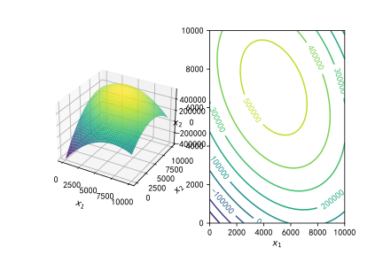

# 有约束的非线性规划

> 1. 非线性规划问题和数学模型
>
>    记$\pmb{x}=[x_1,x_2,\cdots,x_n]^T$是$n$维欧几里得空间$\pmb{R}_n$中的一个点（$n$维向量）。$f(\pmb{x}),g_i(\pmb{x}),i=1,2,\cdots,p$和$h_i(\pmb{x}),j=1,2,\cdots,q$是定义在$\pmb{R}^n$上的实值函数。
>    若$f(\pmb{x}),g_i(\pmb{x}),i=1,2,\cdots,p$和$h_i(\pmb{x}),j=1,2,\cdots,q$中至少有一个是$\pmb{x}$的非线性函数，称如下形式的数学模型：
>    $$
>    \begin{aligned}
>    &\min f(\pmb{x}),\\
>    &s.t.
>    \begin{cases}
>    g_i(\pmb{x})\le0,\quad i=1,2,\cdots,p,\\
>    h_j(\pmb{x})=0,\quad j=1,2,\cdots,q.
>    \end{cases}
>    \end{aligned}
>    $$
>    为非线性规划模型的一般形式。
>
>    称满足所有约束条件的点$\pmb{x}$的集合
>    $$
>    K=\{\pmb{x}\in\pmb{R}^n|g_i(\pmb{x})\le0,i=1,2,\cdots,p;h_j(\pmb x)=0,j=1,2,\cdots,q\}
>    $$
>    为非线性规划问题的约束集或可行域。对任意的$\pmb x\in K$，称$\pmb x$为非线性规划问题的可行解或可行点。
>
>    如果线性规划的最优解存在，最优解只能在可行域的边界上达到（特别是在可行域的顶点上达到），且求出的是全局最优解。但是非线性规划却没有这样好的性质，其最优解（如果存在）可能在可行域的任意一点达到，而一般非线性规划算法给出的也只能是局部最优解，不能保证是全局最优解。
>
> 2. 无约束非线性规划求解
>
>    无约束线性规划问题可具体表示为
>    $$
>    \min f(\pmb x),\pmb x\in\pmb R^n
>    $$
>    平行推广二元函数极值的方法到无约束优化问题中，引入下列定理
>
>    定理一：设$f(\pmb{x})$具有连续的一阶偏导数，且$x^{*}$是无约束问题的局部极小点，则$\nabla f(\pmb{x}^*)$。这里$\nabla f(\pmb{x})$表示函数$f(\pmb{x})$的梯度。
>    定义二：设函数$f(\pmb{x})$具有对各个变量的二阶偏导数，称矩阵
>    $$
>    \begin{bmatrix}
>    \dfrac{\partial^2f}{\partial x_1^2}&\dfrac{\partial^2f}{\partial x_1\partial x_2}&\cdots&\dfrac{\partial^2f}{\partial x_1\partial x_n}\\
>    \dfrac{\partial^2f}{\partial x_2\partial x_1}&\dfrac{\partial^2f}{\partial x_2^2}&\cdots&\dfrac{\partial^2f}{\partial x_2\partial x_n}\\
>    \vdots&\vdots&\ddots&\vdots\\
>    \dfrac{\partial^2f}{\partial x_n\partial x_1}&\dfrac{\partial^2f}{\partial x_n\partial x_2}&\cdots&\dfrac{\partial^2f}{\partial x_n^2}\\
>    \end{bmatrix}
>    $$
>
>    为函数的**Hesse**矩阵，记为$\nabla^2f(\pmb x)$。
>
>    定理二（无约束优化问题有局部最优解的充分条件）：设$f(\pmb x)$具有连续的二阶偏导数，点$\pmb x^*$满足$\nabla f(\pmb x^*)=\pmb 0$；并且$\nabla^2f(\pmb x^*)$为正定阵，则$x^*$为无约束优化问题的局部最优解。
>
> 3. 有约束非线性规划求解
>
>    > 1. 求解**有等式**约束非线性规划的拉格朗日乘数法：
>    >
>    >    对于特殊有等式约束非线性规划问题的情形：
>    >    $$
>  >    \begin{aligned}
>  >    &\min f(\pmb x)\\
>  >    &s.t.
>  >    \begin{cases}
>  >    h_j(\pmb x)=0,\quad j=1,2,\cdots,q,\\
>  >    \pmb x\in \pmb R^n
>  >    \end{cases}
>  >    \end{aligned}\tag{3. 1}
>  >    $$
>    >    由拉格朗日定理：
>    >
>    >    设函数$f,\ h_j(j=1,2,\cdots,q)$在可行点$\pmb x^*$的某个领域$N(\pmb x^*,\ \varepsilon)$可微，向量组$\nabla h_j(\pmb x^*)$线性无关，令
>    >    $$
>  >    L(\pmb x,\pmb\lambda)=f(\pmb x)+\pmb\lambda^TH(\pmb x),
>  >    $$
>    >    其中$\pmb\lambda=[\lambda_1,\lambda_2,\cdots,\lambda_q]^T\in\pmb R^q,\ H(\pmb x)=[h_1(\pmb x),h_2(\pmb x),\cdots,h_q(\pmb x)]^T$。若$\pmb x^*$是（3. 1）局部最优解，则存在实向量$\pmb\lambda^*=[\lambda_1^*,\lambda_2^*,\cdots,\lambda_q^*]^T\in\pmb R^q$，使得$\nabla L(\pmb x^*,\ \pmb\lambda^*)=0$，即
>    >    $$
>  >    \nabla f(\pmb x^*)+\sum_{j=1}^q\pmb\lambda_j^*\nabla h_j(\pmb x^*)=0.
>  >    $$
>    >    将其转换成无约束问题求解。
>    >
>    > 2. 求解有约束非线性规划的罚函数法
>    >
>    >    基本思想：利用目标函数和约束函数构成带多参数的增广目标函数，从而把约束非线性规划问题转换成一系列无约束非线性规划问题来求解。而增广函数通常由两个部分构成，一部分是原问题的目标函数，另一部分是由约束函数构成的“惩罚”项，“惩罚”项的作用是对“违规”的点进行“惩罚”。
>    >
>    >    外部惩罚法（外点法）：迭代的点在可行域外部移动时，随着迭代次数的增加，“惩罚力度”越来越大，从而迫使迭代点向可行域内移动。操作方式：根据不等式约束$g_i(\pmb x)\le0$与等式约束$\max\{0,g_i(\pmb x)\}=0$的等价性，构建增广目标函数（也称罚函数）
>    >    $$
>  >    T(\pmb x,\ M)=f(\pmb x)+M\sum_{i=1}^p[\max\{0,g_i(\pmb x\}]+M\sum_{j=1}^q[h_j(\pmb x)]^2,
>  >    $$
>    >    从而将问题转换成无约束问题：
>    >    $$
>  >    \min T(\pmb x,\ M),\ \pmb x\in\pmb R^n
>  >    $$
>
> 4. 非线性规划的凸优化模型用`cvxpy`的`CVXOPT`求解器进行求解
>
> 相应库（[3. Sympy](3.%20Sympy.md)，[1. Numpy](1.%20Numpy.md)，[2. Scipy](2.%20Scipy.md))

1. 一家彩电制造商计划推出两种产品：一种为19英寸液晶平板电视机，零售价为339美元；另一种为21英寸液晶平板电视机，零售价为399美元。公司付出的成本为19英寸彩电每台195美元，21英寸彩电每台225美元，还要加上400000美元的固定成本。在竞争的销售市场中，每年售出的彩电数量会影响彩电的平均售价。据统计，对每种类型的彩电，每多售出一台，平均销售价格会下降1美分。而且19英寸彩电的销售会影响21英寸彩电的销售，反之亦然。据估计，每售出一台21英寸彩电，19英寸彩电的平均售价会下降0.3美分，而每售出一台19英寸彩电，21英寸彩电的平均售价会下降0.4美分。问题是：每种彩电应该各生产多少台？

   变量：
   $$
   \begin{aligned}
   x_1&:19英寸彩电的售出数量(每年)\\
   x_2&:21英寸彩电的售出数量(每年)\\
   p_1&:19英寸彩电的销售价格(美元)\\
   p_2&:21英寸彩电的销售价格(美元)\\
   c&:生产彩电的成本(美元/年)\\
   r&:彩电销售的收入(美元/年)\\
   f&:彩电销售的利润(美元/年)\\
   \end{aligned}
   $$

   $$
   \max f=r-c,
   $$
   $$
   \begin{cases}
   p_1=339-0.01x_1-0.003x_2\\
   p_2=399-0.01x_2-0.004x_1\\
   c=400000+195x_1+225x_2\\
   r=p_1x_1+p_2x_2\\
   x_1,\ x_2\ge0
   \end{cases}
   $$

   ```python
   import sympy as sp
   import numpy as np
   import matplotlib.pyplot as plt
   
   x1, x2 = sp.symbols('x1, x2')  # 定义符号变量
   y = (339-0.01*x1-0.003*x2)*x1+(399-0.004*x1-0.01*x2)*x2-(400000+195*x1+225*x2)
   # 化简
   y = sp.simplify(y)
   # 求关于x1的偏导
   dy1 = y.diff(x1)
   # 求关于x2的偏导
   dy2 = y.diff(x2)
   s = sp.solve([dy1, dy2], [x1, x2])
   # 取整
   x10 = round(float(s[x1]))
   x20 = round(float(s[x2]))
   # 符号函数代入数值
   y0 = y.subs({x1: x10, x2: x20})
   # 符号函数转换为匿名函数
   f = sp.lambdify('x1, x2', y, 'numpy')
   x = np.linspace(0, 10000, 100)
   # 转换为网格数据
   X, Y = np.meshgrid(x, x)
   Z = f(X, Y)
   
   # 初始化图形
   plt.figure()
   plt.rcParams['font.sans-serif'] = ['SimHei']
   plt.rcParams['axes.unicode_minus'] = False
   # 第一个子窗口三维画图
   ax = plt.subplot(121, projection='3d')
   ax.plot_surface(X, Y, Z, cmap='viridis')
   ax.set_xlabel('$x_1$')
   ax.set_ylabel('$x_2$')
   # 激活第二个子窗口
   plt.subplot(122)
   # 10条等高线
   contr = plt.contour(X, Y, Z, 10)
   # 等高线标注
   plt.clabel(contr)
   plt.ylabel('$x_2$', rotation=0)
   plt.xlabel('$x_1$')
   ```
   
   

# 二次规划模型

> 如果规划模型的目标函数是决策向量$\boldsymbol X=[x_1,x_2,\cdots,x_n]^T$的二次函数，约束条件都是线性的，那么称这个模型为二次规划（`QP`）模型，一般形式为：
> $$
> \max\ (或\min)\sum_{i=1}^n\sum_{j=1}^nc_{ij}x_ix_j+\sum_{i=1}^nd_ix_i,
> $$
> $$
> s.t.
> \begin{cases}
> \displaystyle\sum_{j=1}^na_{ij}x_j\le(\ge,\ =)\ b_i,\quad i=1,2,\cdots,m.\\
> \displaystyle x_i\ge0,\quad i=1,2,\cdots,n.\\
> \end{cases}\\[0.3em]
> $$
> 其中，$c_{ij}=c_{ji},\ i,j=1,2,\cdots,m$
> 
>在二次规划问题中，
> $$
> \boldsymbol H=
> {\begin{bmatrix}
> c_{11}&c_{12}&\cdots&c_{1n}\\
> c_{21}&c_{22}&\cdots&c_{2n}\\
> \vdots&\vdots&\ddots&\vdots\\
> c_{n1}&c_{n2}&\cdots&c_{nn}\\
> \end{bmatrix}}
> \in R^{n\times n}
> $$
> 为对称矩阵，当$\boldsymbol H$正定时，目标函数最小化时，模型为凸二次模型，凸二次模型的局部最优解就是全局最优解
>
> 相应库（[[6. Cvxpy]]）

1. 已知有$A$，$B$，$C$三种股票在过去$12$年的每年收益率如表所示

   | 年份 | $A$的收益率 | $B$的收益率 | $C$的收益率1 |
   | :--: | :---------: | :---------: | :----------: |
   |  1   |     0.3     |    0.225    |    0.149     |
   |  2   |    0.103    |    0.29     |     0.26     |
   |  3   |    0.216    |    0.216    |    0.419     |
   |  4   |   -0.056    |   -0.272    |    -0.078    |
   |  5   |   -0.071    |    0.144    |    0.169     |
   |  6   |    0.056    |    0.107    |    -0.035    |
   |  7   |    0.038    |    0.321    |    0.133     |
   |  8   |    0.089    |    0.305    |    0.732     |
   |  9   |    0.09     |    0.195    |    0.021     |
   |  10  |    0.083    |    0.39     |    0.131     |
   |  11  |    0.035    |   -0.072    |    0.006     |
   |  12  |    0.176    |    0.715    |    0.908     |

   试从两个方面分别给出3支股票的投资比例：
   
   （1）希望将投资组合中的股票收益的方差降到最小，以降低投资风险，并期望年收益率至少达到15%，那么应当如何投资?
   
   （2）希望在方差最大不超过0.09的情况下，获得最大的收益。
   
   > 股票收益的均值衡量的是这种股票的平均收益状况，而收益的方差衡量的是这种股票收益的波动幅度，方差越大则波动越大，收益越不稳定。两种股票收益的协方差表示的则是它们之间的相关程度：
   >
   > * 协方差为0时两者不相关。
   > * 协方差为正表示两者正相关，协方差越大则正相关性越强(越有可能一赚都赚，一赔俱赔）。
   > * 协方差为负表示两者负相关，绝对值越大则负相关性越强（越有可能一个赚，另一个赔）。
   >
   > **$\boldsymbol x^T\boldsymbol F\boldsymbol x$：表示风险估值**
   >
   > **$\boldsymbol\mu^T\boldsymbol x$：表示收益**
   
   $x_1$、$x_2$、$x_3$分别表示$A$、$B$、$C$三只股票的投资比例，其收益率分别记为$R_1$、$R_2$、$R_3$，为随机变量，则投资组合的总收益率为：
   $$
   R=x_1R_1+x_2R_2+x_3R_3.
   $$
   
   
   $R$的数学期望为：
   $$
   E(R)=x_1E(R_1)+x_2E(R_2)+x_3E(R_3).
   $$
   则投资组合的方差为：
   $$
   \begin{aligned}
   \mbox{Var}(R)=&x_1^2\mbox{Var}(R_1)+x_2^2\mbox{Var}(R_2)+x_3^2\mbox{Var}(R_3)+2x_1x_2\mbox{Cov}(R_1,\ R_2)\\[0.4em]
   &+2x_1x_3\mbox{Cov}(R_1,\ R_3)+2x_2x_3\mbox{Cov}(x_2,\ x_3)
   \end{aligned}
   $$
   
   记$\boldsymbol x=[x_1,\ x_2,\ x_3]^T$，协方差矩阵记作$\boldsymbol F$，即：
   $$
   \boldsymbol F=
   \begin{vmatrix}
   0.0111&0.0128&0.0134\\
   0.0128&0.0584&0.0554\\
   0.0134&0.0554&0.0942
   \end{vmatrix}
   $$
   计算时，取$E(R_1)=0.0882,\ E(R_2)=0.2137,\ E(R_3)=0.2346$，记$\boldsymbol\mu=[E(R_1),\ E(R_2),\ E(R_3)]^T$
   
   求解问题（1）
   $$
   \min \boldsymbol x^T\boldsymbol F\boldsymbol x,
   $$
   $$
   s.t.
   \begin{cases}
   x_1+x_2+x_3=1,\\
   \boldsymbol\mu^T\boldsymbol x\ge0.15,\\
   x_1,\ x_2,\ x_3\ge0.
   \end{cases}
   $$
   求解问题（2）
   $$
   \max \boldsymbol\mu^T\boldsymbol x,
   $$
   $$
   s.t.
   \begin{cases}
   x_1+x_2+x_3=1,\\
   \boldsymbol x^T\boldsymbol F\boldsymbol x\le0.09\\
   x_1,\ x_2,\ x_3\ge0.
   \end{cases}
   $$
   
   ```python
   import numpy as np
   import cvxpy as cvx
   
   a = np.loadtxt("data5_4.txt")
   mu = a.mean(axis=0)
   F = np.cov(a.T)
   x = cvx.Variable(3, pos=True)
   
   obj1 = cvx.Minimize(cvx.quad_form(x, F))
   cons1 = [sum(x) == 1,
            mu@x >= 0.15,
            x >= 0]
   prob1 = cvx.Problem(obj1, cons1)
   prob1.solve(solver="CVXOPT")
   print("最优值为：", round(prob1.value, 4))
   print("最优解为：", np.round(x.value, 4))
   print('-'*32)
   obj2 = cvx.Maximize(mu@x)
   cons2 = [sum(x) == 1,
            cvx.quad_form(x, F) <= 0.09,
            x >= 0]
   prob2 = cvx.Problem(obj2, cons2)
   prob2.solve(solver="CVXOPT")
   print("最优值为：", round(prob2.value, 4))
   print("最优解为：", np.round(x.value, 4))
   ```

# 一般的非线性规划问题
> 对于一般的非线性规划问题，由于不是凸优化，就不能使用[6. Cvxpy](6.%20Cvxpy.md)求解，求解一般使用[2. Scipy](2.%20Scipy.md)中的`optimize.minimize`函数求解
> 常规解法：
> 1. 先用[1. Numpy](1.%20Numpy.md)模块`np.random`将未知数设出来
> 2. 再将设出来的未知数代入[2. Scipy](2.%20Scipy.md)`optimize.minimize`中求解

1. 建筑工地的位置（单位$\mbox{km}$）及其水泥日用量$c$（单位$t$）。拟建造两个料场向6个工地运送水泥，两个料场日储存量各为$20t$，问料场建在何处，使总的吨公里数最小

	<table>
	<tr height=18 style='height:13.8pt'>
	<td rowspan=2 height=36 width=64 style='height:27.6pt;width:48pt'>参数</td>
	<td colspan=6 width=384 style='width:288pt'>工地</td>
	</tr>
	<tr height=18 style='height:13.8pt'>
	<td height=18 align=center style='height:13.8pt'>1</td>
	<td align=center>2</td>
	<td align=center>3</td>
	<td align=center>4</td>
	<td align=center>5</td>
	<td align=center>6</td>
	</tr>
	<tr height=18 style='height:13.8pt'>
	<td height=18 style='height:13.8pt'>a/km</td>
	<td class=xl65 align=center>1.25</td>
	<td class=xl65 align=center>8.75</td>
	<td class=xl65 align=center>0.5</td>
	<td class=xl65 align=center>3.75</td>
	<td class=xl65 align=center>3</td>
	<td class=xl65 align=center>7.25</td>
	</tr>
	<tr height=18 style='height:13.8pt'>
	<td height=18 style='height:13.8pt'>b/km</td>
	<td class=xl65 align=center>1.25</td>
	<td class=xl65 align=center>0.75</td>
	<td class=xl65 align=center>4.75</td>
	<td class=xl65 align=center>5</td>
	<td class=xl65 align=center>6.5</td>
	<td class=xl65 align=center>7.75</td>
	</tr>
	<tr height=18 style='height:13.8pt'>
	<td height=18 style='height:13.8pt'>c/t</td>
	<td class=xl65 align=center>3</td>
	<td class=xl65 align=center>5</td>
	<td class=xl65 align=center>4</td>
	<td class=xl65 align=center>7</td>
	<td class=xl65 align=center>6</td>
	<td class=xl65 align=center>11</td>
	</tr>
	</table>

   设第$i$个工地的位置为$(a_i,\,b_i)(i=1,2,\cdots,6)$，水泥日用量为$c_i$；拟建场位置为$(x_i,\,y_i)(i=1,2)$，日储量为$e_j$，从料场$j$向工地$i$的运送量为$z_{ij}$

   建立模型如下：
   $$
   \min \sum_{i=1}^6\sum_{j=1}^2z_{ij}\sqrt{(x_j-a_i)^2+(y_j-b_i)^2},
   $$
   $$
   s.t.
   \begin{cases}
   \displaystyle\sum_{j=1}^2z_{ij}=c_i,\quad i=1,2,\cdots,6,\\
   \displaystyle\sum_{i=1}^6z_{ij}\le e_{ij},\quad j=1,2,\\
   z_{ij}\ge0,\quad i=1,2,\cdots,6;j=1,2.
   \end{cases}
   $$
   
   ```python
   import numpy as np
   from scipy.optimize import minimize

   d = np.loadtxt('data5_8.txt')
   a = d[0]
   b = d[1]
   c = d[2]
   e = np.array([20, 20])

   def obj(xyz):
       x = xyz[: 2]; y = xyz[2: 4]
       z = xyz [4:].reshape(6,2)
       res =0
       for i in range(6):
           for j in range(2):
               res += z[i,j] * np.sqrt((x[j]-a[i])**2+(y[j]-b[i])**2)
       return res

   con = []
   con.append({'type': 'eq', 'fun': lambda z: z[4:].reshape(6,2).sum(axis=1)-c})
   con.append({'type': 'ineq', 'fun': lambda z: e-z[4:].reshape(6,2).sum(axis=0)})
   bd = [(0, np.inf) for i in range(16)]  #决策向量的界限
   res = minimize(obj, np.random.rand(16), constraints=con, bounds=bd)
   print(res)  #输出解的信息
   s=np.round(res.x, 4)     #提出最优解的取值
   print('目标函数的最优值：', round(res.fun,4))
   print('x的坐标为：', s[:2])
   print('y的坐标为：', s[2:4])
   print('料场到工地的运输量为：\n', s[4:].reshape(6,2).T)
   ```

# 多目标规划
> 在进行多目标的规划的同时，希望每一个目标值都能尽可能的大（或小）时，就形成多目标规划问题，其一般形式为：
> $$
> \min f(\boldsymbol x)=[f_1(\boldsymbol x),f_2(\boldsymbol x),\cdots,f_m(\boldsymbol x)]^T,
> $$
> 
> $$
> s.t.
> \begin{cases}
> g_i(\boldsymbol x)\le0,\quad i=1,\,2,\,\cdots,\,p,\\
> h_j(\boldsymbol x)=0,\quad j=1,\,2,\,\cdots,\,q.
> \end{cases}
> $$
> 
> 可行域：
> $$
> \Omega={\boldsymbol x|g_i(\boldsymbol x)\le0,i=1,\,2,\,\cdots,\,,p;h_i(\boldsymbol x)\le0,j=1,\,2,\,\cdots,\,,q}.
> $$

1. 某公司考虑生产两种光电太阳能电池：产品甲和产品乙。这种生产会引起空气放射性污染。因此，公司经理有两个目标：极大化利润与极小化总的放射性污染。已知在一个生产周期内，每单位产品的收益、放射性污染排放量、机器能力（h）、装配能力(h)和可用的原材料(单位）的限制如表所示。假设市场需求无限制，两种产品的产量和至少为10，则公司该如何安排一个生产周期内的生产。

   |   参数   | 单位甲产品 | 单位乙产品 | 资源限量 |
   |:--------:|:----------:|:----------:|:--------:|
   | 设备工时 |    0.5     |    0.25    |    8     |
   | 工人工时 |    0.2     |    0.2     |    4     |
   |  原材料  |     1      |     5      |    72    |
   |   利润   |     2      |     3      |    -     |
   | 污染排放 |     1      |     2      |    -     |

   