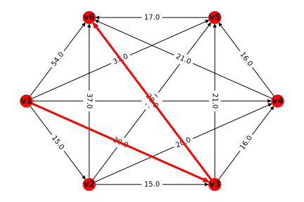

> 一个**无向图**$G$是由非空顶点集$V$和边集$E$按一定的对应关系构成的连接结构，记为$G=(V，E)$。其中非空集合$V=\{v_1,\,v_2,\,\cdots,\,v_n\}$为$G$的顶点集，$V$中的元素称为$G$的顶点，其元素的个数为顶点数；集合$E=\{e_1,\,e_2,\,\cdot,\,e_m\}$为$G$的边集，$E$中的元素称为$G$的边，其元素的个数为图$G$的边数
>
> 以下用$|V|$表示图$G=(V,\,E)$中顶点的个数，$|E|$表示边的条数。图$G$的每一条边是由连接$G$中两个顶点而得到的一条线（可以是直线或曲线)，因此与$G$的顶点对相对应，通常记作$e1=(v_i,\,v_j)$，其中，顶点$v_i,\,v_j$称为边$e_k$的两个端点，有时也说边$e_k$与顶点$v_i,\,v_j$关联
>
> 对无向图来说，对应一条边的顶点对表示是无序的，即$(v_i,\,v_j)$和$(v_j,\,v_i)$表示同一条边$e_k$
>
> 有公共端点的两条边，称为邻边。同样，同一条边$e_k$的两个端点$(v_i和v_j)$称为是相邻的顶点
>
> 带有方向的边称为有向边，又称为弧。如果给无向图的每条边规定一个方向，我们就得到**有向图**
>
> 赋权图：
>
> 如果图$G$的每条边$e$都附有一个实数$w(e)$，则称图$G$为**赋权图**，实数$w(e)$称为边$e$的权。赋权图也称为网络。赋权图中的权可以是距离、费用、时间、效益、成本等。赋权图$G$一般记作$G=(V,\,E,\,W)$，其中$W$为权重的邻接矩阵。赋权图也可以记作$N=(V,\,E,\,W)$
>
> 1. 度
>    * 在无向图中，与顶点$v$关联的边的数目（环算两次）称为$v$的度，记为$d(v)$
>    * 在有向图中，从顶点$v$引出的弧的数目称为$v$的出度，记为$d^+(v)$，从顶点$v$引入的弧的数目称为$v$的入度，记为$d^-(v)$，$d(v)=d^+(v)+d^-(v)$称为$v$的度
>
>    <u>度为奇数的顶点称为奇顶点，度为偶数的顶点称为偶顶点</u>
>
> 2. 子图
>    设$G_1=(V_1,\,E_1)$与$G_2=(V_2,\,E_2)$是两个图，并且满足$V_1\subset V_2$，$E_1\subset E_2$，则称$G_1$是$G_2$的子图，$G_2$称为$G_1$的母图。如$G_1$是$G_2$的子图，且$V_1=V_2$，则称$G_1$是$G_2$的生成子图（支撑子图）。
>
> 4. 连通子图
>    在无向图$G$中，如果从顶点$u$到顶点$v$存在道路，则称顶点$u$和$v$是连通的。如果图$G$中的任意两个顶点$u$和$v$都是连通的，则称图$G$是连通图，否则称为非连通图。非连通图中的连通子图，称为连通分支
>
>    在有向图$D$中，如果对于任意两个顶点$u$和$v$，从$u$到$v$和从$v$到$u$都存在道路，则称图$D$是强连通图
>
> 矩阵形式表示：
>
> 设图的顶点个数为$n$，边（或弧）的条数为$m$。对于无向图$G=(V,E)$，其中$V=\{v_1,v_2,\cdots,v_n\}$，$E=\{e_1,e_2,\cdots,e_m\}$。对于有向图$D=(V,A)$，其中$V=\{v_1,v_2,\cdots,v_n\}$，$A=\{a_1,a_2,\cdots,a_m\}$
>
> 1. 关联矩阵：
>
>    对于无向图$G$，其关联矩阵$M=(m_{ij})_{n\times m}$，其中
>    $$
>    m_{ij}=
>    \begin{cases}
>    1,\quad 顶点v_i与边e_j关联,\\
>    0,\quad 顶点v_i与e_j不关联,
>    \end{cases}
>    i=1,2,\cdots,n,j=1,2,\cdots,m.
>    $$
>    对于有向图$G$，其关联矩阵$M=(m_{ij})_{n\times m}$，其中
>    $$
>    m_{ij}=
>    \begin{cases}
>    1,\quad 顶点v_i与边e_j的始端,\\
>    -1,\quad 顶点v_i与e_j的末端,\\
>    0,\quad 顶点v_i与e_j不关联.
>    \end{cases}
>    i=1,2,\cdots,n,j=1,2,\cdots,m.
>    $$
>
> 2. 邻接矩阵
>    对于无向非赋权图$G$，其邻接矩阵$W=(w_{ij})_{n\times m}$，其中
>    $$
>    w_{ij}=
>    \begin{cases}
>    1,\quad 顶点v_i与边v_j关联,\\
>    0,\quad i=j或顶点v_i与v_j不关联,
>    \end{cases}
>    i,j=1,2,\cdots,n.
>    $$
>    对于无向非赋权图$G$，其邻接矩阵$W=(w_{ij})_{n\times m}$，其中
>    $$
>    w_{ij}=
>    \begin{cases}
>    1,\quad 弧(v_i,\,v_j)\in A,\\
>    0,\quad i=j或顶点v_i与v_j无弧,
>    \end{cases}
>    i,j=1,2,\cdots,n.
>    $$
>
>    对于无向赋权图$G$，其邻接矩阵$W=(w_{ij})_{n\times m}$，其中
>    $$
>    w_{ij}=
>    \begin{cases}
>    顶点v_i与v_j之间的权,\quad (v_i,\,v_j)\in E,\\
>    0(或\infty),\quad v_i与v_j之间无边,
>    \end{cases}
>    i,j=1,2,\cdots,n.
>    $$
>
> **[7. NetworkxX](7.%20NetworkxX.md)**
>
> |          代码           |      含义      |
> | :---------------------: | :------------: |
> |    `G = nx.Graph()`     |   创建无向图   |
> |   `G = nx.DiGraph()`    |   创建有向图   |
> |  `G = nx.MultiGraph()`  | 创建多重无向图 |
> | `G = nx.MultiDiGraph()` | 创建多重有向图 |
>
> `nx.draw(G, pos, edge_labels=None, label_pos=0.5, font_size=10, font_color="k", font_family="sans-serif", font_weight="normal", alpha=None, bbox=None, horizontalalignment="center", verticalalignment="center", ax=None, rotate=True, clip_on=True)`
>
> **Parameters**
>
> * `G`: graph
>
>   A networkx graph
>
> * `pos`: dictionary
>
>   A dictionary with nodes as keys and positions as values. Positions should be sequences of length 2.
>
> * `edge_labels`: dictionary (default=None)
>
>   Edge labels in a dictionary of labels keyed by edge two-tuple. Only labels for the keys in the dictionary are drawn.
>
> * `label_pos`: float (default=0.5)
>
>   Position of edge label along edge (0=head, 0.5=center, 1=tail)
>
> * `font_size`: int (default=10)
>
>   Font size for text labels
>
> * `font_color`: string (default='k' black)
>
>   Font color string
>
> * `font_weight`: string (default='normal')
>
>   Font weight
>
> * `font_family`: string (default='sans-serif')
>
>   Font family
>
> * `alpha`: float or None (default=None)
>
>   The text transparency
>
> * `bbox`: Matplotlib bbox, optional
>
>   Specify text box properties (e.g. shape, color etc.) for edge labels. Default is {boxstyle='round', ec=(1.0, 1.0, 1.0), fc=(1.0, 1.0, 1.0)}.
>
> * `horizontalalignment`: string (default='center')
>
>   Horizontal alignment {'center', 'right', 'left'}
>
> * `verticalalignment`: string (default='center')
>
>   Vertical alignment {'center', 'top', 'bottom', 'baseline', 'center_baseline'}
>
> * `ax`: Matplotlib Axes object, optional
>
>   Draw the graph in the specified Matplotlib axes.
>
> * `rotate`: bool (deafult=True)
>
>   Rotate edge labels to lie parallel to edges
>
> * `clip_on`: bool (default=True)
>
>   Turn on clipping of edge labels at axis boundaries
>
> **Returns**
>
> * `dict`
>
>   dict of labels keyed by edge
>
> **基本函数**
>
> `G.add_node(1)`添加一个点
>
> `G.add_nodes_from(['A', 'B', 1, 2])`：添加多个顶点
>
> `G.add_edge(1, 2, weight=0.5)`：添加一条边
>
> `G.add_edges_from([('A', 'B'), (1, 2)])`：添加多条边
>
> `G.add_weighted_edges_from([(1, 2, 0.5], [3, 4, 0.4])`：添加权重边
>
> `G.adj`：显示图的邻接表的字典数据
>
> `G.adjacency`：显示图的邻接表的列表数据
>
> `nx.to_numpy_matrix(G)`：从G中导出邻接矩阵向量
> `nx.spring_layout(G)`：该算法模拟网络的force-directed 表示，将边视为使节点靠近的弹簧，同时将节点视为排斥对象，有时称为反重力。模拟继续进行，直到位置接近平衡。
>
> `nx.get_edge_attributes(G, "weight")`：导出赋权边的字典数据
>
> `nx.draw_networkx_edge_labels(G, pos, font_size, edge_labels)`：添加边的标注
>
> **算法**
>
> * 最短路径
>
>   `dijkstra_path(G, source, target, weight="weight")`
>
> * 最短距离
>
>   `dijkstra_path_length(G, source, target, weight="weight")`

1. 设备更新问题。某企业使用一台设备，在每年年初，企业领导部门就要决定是购置新的，还是继续使用旧的。若购置新设备，就要支付一定的购置费用；若继续使用旧设备，则需支付更多的维修费用。现在的问题是如何制定一个几年之内的设备更新计划，使得总的支付费用最少。我们用一个5年之内要更新某种设备的计划为例，若已知该种设备在各年年初的价格如表所列，还已知使用不同时间（年）的设备所需要的维修费用如表所列。如何制定总的支付费用最少的设备更新计划？

   设备价格表

   | 第1年 | 第2年 | 第3年 | 第4年 | 第5年 |
   | :---: | :---: | :---: | :---: | :---: |
   |  11   |  11   |  12   |  12   |  13   |

   维修费用表

   | 使用年限 | 0~1  | 1~2  | 2~3  | 3~4  | 4~5  |
   | :------: | :--: | :--: | :--: | :--: | :--: |
   | 维修费用 |  4   |  5   |  7   |  10  |  17  |

   将此问题转换成最小路径问题：

   构造有向图$D=(V,A,\boldsymbol W)$，其中顶点集$\boldsymbol V=\{v_1,v_2,\cdots,v_6\}$，$v_i$表示第$i$年初，$v_6$表示第$5$年末，$A$为弧的集合，邻接矩阵$\boldsymbol W=(w_{ij})_{6\times6}$表示时刻$v_i$购置新设备到时刻$v_j$购置新设备的费用和维修费用之和。
   $$
   \boldsymbol W=
   \left[\begin{matrix}
   0 & 15.0 & 20.0 & 27.0 & 37.0 & 54.0\\
   0 & 0 & 15.0 & 20.0 & 27.0 & 37.0\\
   0 & 0 & 0 & 16.0 & 21.0 & 28.0\\
   0 & 0 & 0 & 0 & 16.0 & 21.0\\
   0 & 0 & 0 & 0 & 0 & 17.0\\
   0 & 0 & 0 & 0 & 0 & 0
   \end{matrix}\right]
   $$

   ```python
   import networkx as nx
   import numpy as np
   
   l = np.zeros((6, 6))
   
   a = [11, 11, 12, 12, 13]
   b = [4, 5, 7, 10, 17]
   
   for i in range(6):
       for j in range(6):
           if i >= j:
               pass
           else:
               sum = 0
               for k in range(j-i):
                   sum += b[k]
               l[i, j] = a[i]+sum
   
   G = nx.DiGraph(l)
   path = nx.dijkstra_path(G, 0, 5, weight="weight")
   dis = nx.dijkstra_path_length(G, 0, 5, weight="weight")
   print("最短路径：", [i+1 for i in path])
   print("最小费用：", dis)
   ```

   

